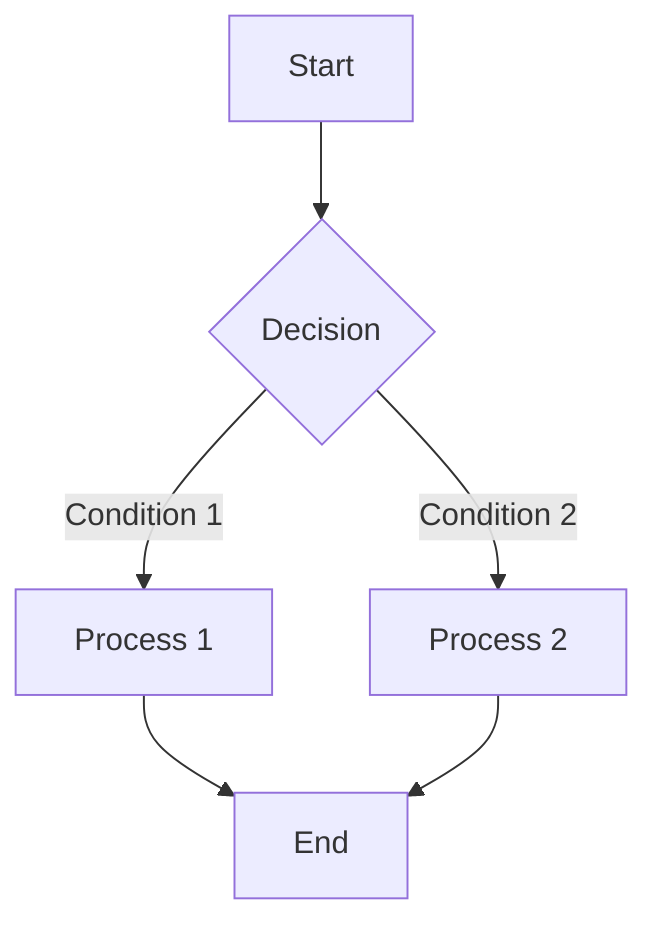
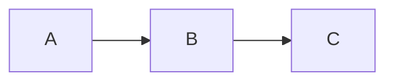

# @unify-js/vitepress-mermaid

A VitePress custom theme that provides fullscreen preview functionality for Mermaid diagrams, supporting zoom and drag-to-pan interactions.

## Features

- 🎯 **Click to Preview** - Click on Mermaid diagrams in your documentation to view them in fullscreen
- 🔍 **Free Zoom** - Supports zoom in/out/reset, with convenient mouse wheel zooming
- 🖐️ **Drag to Pan** - Drag to move and explore diagram details
- 🌓 **Dark Mode** - Automatically adapts to VitePress dark/light themes
- ⌨️ **Keyboard Shortcuts** - ESC to close, Ctrl/Cmd + +/- to zoom
- 📱 **Responsive Design** - Mobile-friendly interaction experience

## Installation

```bash
pnpm add @unify-js/vitepress-mermaid
# or
npm install @unify-js/vitepress-mermaid
# or
yarn add @unify-js/vitepress-mermaid
```

## Dependency Requirements

This custom theme requires the following dependencies to work properly. Please make sure they are installed:

```bash
pnpm add -D vitepress mermaid
```

## Usage

### Method 1: Using Theme Extension (Recommended)

In `.vitepress/theme/index.ts`:

```typescript
import type { Theme } from 'vitepress';
import mermaidTheme from '@unify-js/vitepress-mermaid';

export default {
  extends: mermaidTheme,
} satisfies Theme;
```

### Method 2: Manual Configuration

For more flexible control, you can configure manually:

```typescript
import { h } from 'vue';
import type { Theme } from 'vitepress';
import DefaultTheme from 'vitepress/theme';
import { Mermaid, MermaidPreview } from '@unify-js/vitepress-mermaid';

export default {
  extends: DefaultTheme,
  enhanceApp({ app }) {
    app.component('Mermaid', Mermaid);
    app.component('MermaidPreview', MermaidPreview);
  },
  Layout() {
    return h(DefaultTheme.Layout, null, {
      'layout-bottom': () => h(MermaidPreview),
    });
  },
} satisfies Theme;
```

### Configure markdown-it Plugin

In `.vitepress/config.ts`:

```typescript
import { defineConfig } from 'vitepress';
import { mermaidMarkdownPlugin } from '@unify-js/vitepress-mermaid';

export default defineConfig({
  markdown: {
    config: md => {
      mermaidMarkdownPlugin(md);
    },
  },
});
```

## Using in Markdown

The custom theme automatically recognizes `mermaid` code blocks:

````markdown

````

### Display Source Code

Use the `mermaid-example` language identifier to display both the diagram and its source code:

````markdown

````

## API Reference

### mermaidMarkdownPlugin

markdown-it plugin that converts mermaid code blocks to Vue components.

```typescript
import { mermaidMarkdownPlugin } from '@unify-js/vitepress-mermaid';

md.use(mermaidMarkdownPlugin);
```

## Keyboard Shortcuts

| Shortcut       | Function             |
| -------------- | -------------------- |
| `ESC`          | Close preview window |
| `Ctrl/Cmd + +` | Zoom in              |
| `Ctrl/Cmd + -` | Zoom out             |
| `Ctrl/Cmd + 0` | Reset zoom           |
| `Mouse wheel`  | Zoom                 |
| `Drag`         | Move diagram         |

## Requirements

- `vitepress`: ^1.0.0
- `mermaid`: ^11.0.0

## License

MIT
