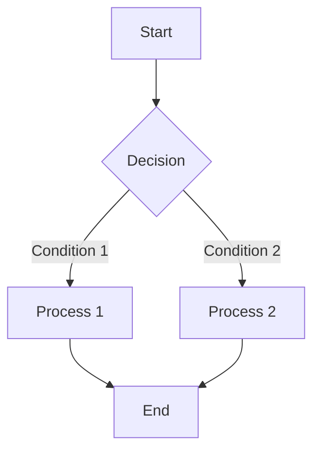
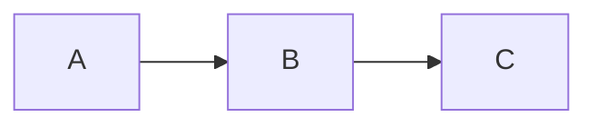

# @unify-js/vitepress-plugin-mermaid

A VitePress plugin that provides fullscreen preview functionality for Mermaid diagrams, supporting zoom and drag-to-pan interactions.

## Features

- 🎯 **Click to Preview** - Click on Mermaid diagrams in your documentation to view them in fullscreen
- 🔍 **Free Zoom** - Supports zoom in/out/reset, with convenient mouse wheel zooming
- 🖐️ **Drag to Pan** - Drag to move and explore diagram details
- 🌓 **Dark Mode** - Automatically adapts to VitePress dark/light themes
- ⌨️ **Keyboard Shortcuts** - ESC to close, Ctrl/Cmd + +/- to zoom
- 📱 **Responsive Design** - Mobile-friendly interaction experience

## Installation

```bash
pnpm add @unify-js/vitepress-plugin-mermaid
# or
npm install @unify-js/vitepress-plugin-mermaid
# or
yarn add @unify-js/vitepress-plugin-mermaid
```

## Usage

### Method 1: Using Theme Extension (Recommended)

In `.vitepress/theme/index.ts`:

```typescript
import type { Theme } from "vitepress";
import mermaidPluginTheme from "@unify-js/vitepress-plugin-mermaid/theme";

export default {
  extends: mermaidPluginTheme,
} as Theme;
```

### Method 2: Manual Configuration

For more flexible control, you can configure manually:

```typescript
import { h } from "vue";
import type { Theme } from "vitepress";
import DefaultTheme from "vitepress/theme";
import Mermaid from "@unify-js/vitepress-plugin-mermaid/components/Mermaid.vue";
import MermaidPreview from "@unify-js/vitepress-plugin-mermaid/components/MermaidPreview.vue";

export default {
  extends: DefaultTheme,
  enhanceApp({ app }) {
    app.component("Mermaid", Mermaid);
    app.component("MermaidPreview", MermaidPreview);
  },
  Layout() {
    return h(DefaultTheme.Layout, null, {
      "layout-bottom": () => h(MermaidPreview),
    });
  },
} as Theme;
```

### Configure markdown-it Plugin

In `.vitepress/config.ts`:

```typescript
import { defineConfig } from "vitepress";
import { mermaidMarkdownPlugin } from "@unify-js/vitepress-plugin-mermaid/mermaid-markdown";

export default defineConfig({
  markdown: {
    config: (md) => {
      mermaidMarkdownPlugin(md);
    },
  },
});
```

## Using in Markdown

The plugin automatically recognizes `mermaid` code blocks:

````markdown

````

### Display Source Code

Use the `mermaid-example` language identifier to display both the diagram and its source code:

````markdown

````

## Project Structure

### Source Structure

```
packages/vitepress-plugin-mermaid-preview/
├── src/
│   ├── components/
│   │   ├── Mermaid.vue           # Diagram rendering component (Vue SFC)
│   │   └── MermaidPreview.vue    # Fullscreen preview component (Vue SFC)
│   ├── composables/
│   │   └── useMermaidPreview.ts  # State management
│   ├── index.ts                  # Main entry, exports all features
│   ├── theme.ts                  # Theme configuration, one-click integration
│   └── mermaid-markdown.ts       # markdown-it plugin
├── dist/                         # Build output (included in publish)
│   ├── index.js                  # Main entry
│   ├── index.d.ts                # Type declarations
│   ├── theme.js                  # Theme configuration
│   ├── theme.d.ts                # Type declarations
│   ├── mermaid-markdown.js       # markdown-it plugin
│   ├── mermaid-markdown.d.ts     # Type declarations
│   ├── components/
│   │   ├── Mermaid.vue           # Vue SFC (copied)
│   │   └── MermaidPreview.vue    # Vue SFC (copied)
│   └── composables/
│       ├── useMermaidPreview.js  # Compiled composable
│       └── useMermaidPreview.d.ts # Type declarations
├── playground/                   # Debug playground
│   ├── index.html
│   ├── main.ts
│   ├── App.vue
│   └── vite.config.ts
├── package.json
├── tsconfig.json
├── vite.config.ts
└── README.md
```

### Export Paths

| Import Path | Description |
| -------------------------------------------------------------------------- | --------------------------------------- |
| `@unify-js/vitepress-plugin-mermaid` | Main entry, exports `mermaidMarkdownPlugin`, etc. |
| `@unify-js/vitepress-plugin-mermaid/theme` | Theme configuration, recommended approach |
| `@unify-js/vitepress-plugin-mermaid/mermaid-markdown` | markdown-it plugin |
| `@unify-js/vitepress-plugin-mermaid/components/Mermaid.vue` | Mermaid component (Vue SFC) |
| `@unify-js/vitepress-plugin-mermaid/components/MermaidPreview.vue` | Preview component (Vue SFC) |
| `@unify-js/vitepress-plugin-mermaid/composables/useMermaidPreview` | State management composable |

## Development Guide

### Local Development

```bash
# Navigate to plugin directory
cd packages/vitepress-plugin-mermaid-preview

# Install dependencies
pnpm install

# Development mode (watch file changes)
pnpm dev

# Build
pnpm build
```

### Playground Debugging

The plugin provides a Playground page where you can edit Mermaid code in real-time and test the preview functionality.

```bash
# Navigate to plugin directory
cd packages/vitepress-plugin-mermaid-preview

# Start playground
pnpm playground
```

Playground Features:

- 📝 Code editor on the left, real-time diagram rendering
- 🎨 One-click toggle between dark/light themes
- 📋 Built-in diagram examples (flowcharts, sequence diagrams, class diagrams, ER diagrams, Gantt charts)
- 💾 Download generated SVG files
- 🔍 Click on diagrams to open fullscreen preview and test all interaction features

### Debugging in Documentation Site

```bash
cd docs
pnpm dev
```

### Code Standards

- Write code using TypeScript
- Components use `<script setup>` syntax
- Styles use scoped CSS
- Use named exports, default export is theme configuration

## API Reference

### useMermaidPreview

Composable for controlling the preview window.

```typescript
import { useMermaidPreview } from "@unify-js/vitepress-plugin-mermaid";

const { isOpen, svg, open, close } = useMermaidPreview();

// Open preview
open("<svg>...</svg>");

// Close preview
close();
```

| Property/Method | Type | Description |
| --------- | ----------------------- | ------------------- |
| `isOpen` | `ComputedRef<boolean>` | Whether the preview window is open |
| `svg` | `ComputedRef<string>` | Current preview SVG content |
| `open` | `(svg: string) => void` | Open preview window |
| `close` | `() => void` | Close preview window |

### mermaidMarkdownPlugin

markdown-it plugin that converts mermaid code blocks to Vue components.

```typescript
import { mermaidMarkdownPlugin } from "@unify-js/vitepress-plugin-mermaid";

md.use(mermaidMarkdownPlugin);
```

## Keyboard Shortcuts

| Shortcut | Function |
| -------------- | ------------ |
| `ESC` | Close preview window |
| `Ctrl/Cmd + +` | Zoom in |
| `Ctrl/Cmd + -` | Zoom out |
| `Ctrl/Cmd + 0` | Reset zoom |
| `Mouse wheel` | Zoom |
| `Drag` | Move diagram |

## FAQ

### TypeScript Cannot Recognize `.vue` Files

If you encounter errors like the following when using TypeScript:

```
Cannot find module './components/Mermaid.vue' or its corresponding type declarations.
```

This is because TypeScript doesn't recognize `.vue` file types by default. The solution is to create a type declaration file in your project:

**Method: Create `env.d.ts` file**

Create an `env.d.ts` file in your project root (or `src` directory):

```typescript
/// <reference types="vite/client" />

declare module "*.vue" {
  import type { DefineComponent } from "vue";
  const component: DefineComponent<{}, {}, any>;
  export default component;
}
```

Then ensure this file is included in `tsconfig.json`:

```json
{
  "include": ["src/**/*", "env.d.ts"]
}
```

**Note:** If you're using VitePress, support for `.vue` files is usually built-in and doesn't require additional configuration.

## Requirements

- `vitepress`: ^1.0.0
- `vue`: ^3.0.0
- `mermaid`: ^10.0.0 || ^11.0.0

## License

MIT
