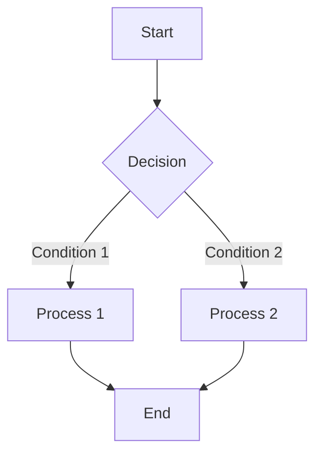
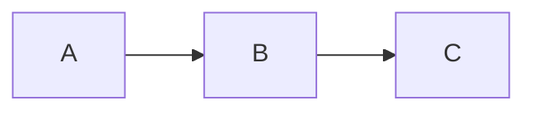

# @unify-js/vitepress-mermaid

A VitePress custom theme that provides fullscreen preview functionality for Mermaid diagrams, supporting zoom and drag-to-pan interactions.

## Features

- 🎯 **Click to Preview** - Click on Mermaid diagrams in your documentation to view them in fullscreen
- 🔍 **Free Zoom** - Supports zoom in/out/reset, with convenient mouse wheel zooming
- 🖐️ **Drag to Pan** - Drag to move and explore diagram details
- 🌓 **Dark Mode** - Automatically adapts to VitePress dark/light themes
- ⌨️ **Keyboard Shortcuts** - ESC to close, Ctrl/Cmd + +/- to zoom
- 📱 **Responsive Design** - Mobile-friendly interaction experience

## Installation

```bash
pnpm add @unify-js/vitepress-mermaid
# or
npm install @unify-js/vitepress-mermaid
# or
yarn add @unify-js/vitepress-mermaid
```

## Dependency Requirements

This custom theme requires the following dependencies to work properly. Please make sure they are installed:

```bash
pnpm add -D vitepress mermaid
```

## Usage

### Step 1: Configure VitePress Config

In `.vitepress/config.ts`:

```typescript
import { defineConfig } from 'vitepress';
import { withMermaidConfig } from '@unify-js/vitepress-mermaid/config';

export default withMermaidConfig(
  defineConfig({
    // Your VitePress config
  })
);
```

> **Important:** The config helper must be imported from `@unify-js/vitepress-mermaid/config` (with `/config` suffix), not from the root package. This is because VitePress config runs in Node.js, while the theme runs in the browser. Keeping them separate prevents module resolution errors.

### Step 2: Configure Theme

In `.vitepress/theme/index.ts`:

```typescript
import type { Theme } from 'vitepress';
import { MermaidTheme } from '@unify-js/vitepress-mermaid';

export default {
  extends: MermaidTheme,
} satisfies Theme;
```

## Using in Markdown

The custom theme automatically recognizes `mermaid` code blocks:

````markdown

````

### Display Source Code

Use the `mermaid-example` language identifier to display both the diagram and its source code:

````markdown

````

## API Reference

### mermaidMarkdownPlugin

markdown-it plugin that converts mermaid code blocks to Vue components.

```typescript
import { mermaidMarkdownPlugin } from '@unify-js/vitepress-mermaid';

md.use(mermaidMarkdownPlugin);
```

## Keyboard Shortcuts

| Shortcut       | Function             |
| -------------- | -------------------- |
| `ESC`          | Close preview window |
| `Ctrl/Cmd + +` | Zoom in              |
| `Ctrl/Cmd + -` | Zoom out             |
| `Ctrl/Cmd + 0` | Reset zoom           |
| `Mouse wheel`  | Zoom                 |
| `Drag`         | Move diagram         |

## Requirements

- `vitepress`: ^1.0.0
- `mermaid`: ^11.0.0

## License

MIT
