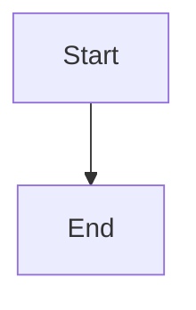
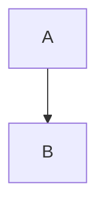

# Markdown Plugin

The markdown-it plugin that transforms Mermaid code blocks into interactive components.

## Import

```typescript
import { mermaidMarkdownPlugin } from '@unify-js/vitepress-plugin-mermaid/mermaid-markdown';
// or
import { mermaidMarkdownPlugin } from '@unify-js/vitepress-plugin-mermaid';
```

## Configuration

### Basic Setup

```typescript
// .vitepress/config.ts
import { defineConfig } from 'vitepress';
import { mermaidMarkdownPlugin } from '@unify-js/vitepress-plugin-mermaid/mermaid-markdown';

export default defineConfig({
  markdown: {
    config: md => {
      mermaidMarkdownPlugin(md);
    },
  },
});
```

## Supported Code Blocks

### `mermaid`

Standard Mermaid code blocks are rendered as interactive diagrams:

````markdown

````

### `mermaid-example`

Displays both the diagram and its source code:

````markdown

````

This renders as:

- The Mermaid diagram (clickable for preview)
- A code block showing the source

## How It Works

The plugin processes Markdown code blocks during the build:

1. **Scanning** - Identifies `mermaid` and `mermaid-example` code blocks
2. **Transformation** - Replaces them with Vue component tags
3. **Rendering** - The Mermaid component handles client-side rendering

### Before (Markdown)

````markdown

````

### After (HTML)

```html
<Mermaid code="graph TD; A --> B;" />
```

## Integration with VitePress

The plugin is designed specifically for VitePress and:

- Works with VitePress's Markdown pipeline
- Respects VitePress's theme settings
- Supports hot module replacement in dev mode
- Is compatible with other Markdown plugins

## Customization

Currently, the plugin works with default settings. Future versions may support:

- Custom block types
- Rendering options
- Theme configuration
- Error handling customization

## Error Handling

When a diagram fails to render:

1. The error is logged to the console
2. A fallback message is displayed
3. Other diagrams on the page continue to work

Example error display:

```
[Mermaid Error]
Parse error on line 2:
graph TD  invalid_syntax
--------------^
Expecting 'SPACE', 'GRAPH', got 'ALPHA'
```
