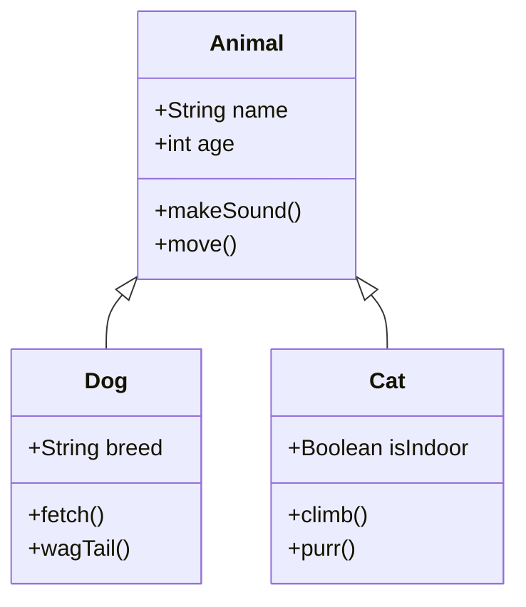
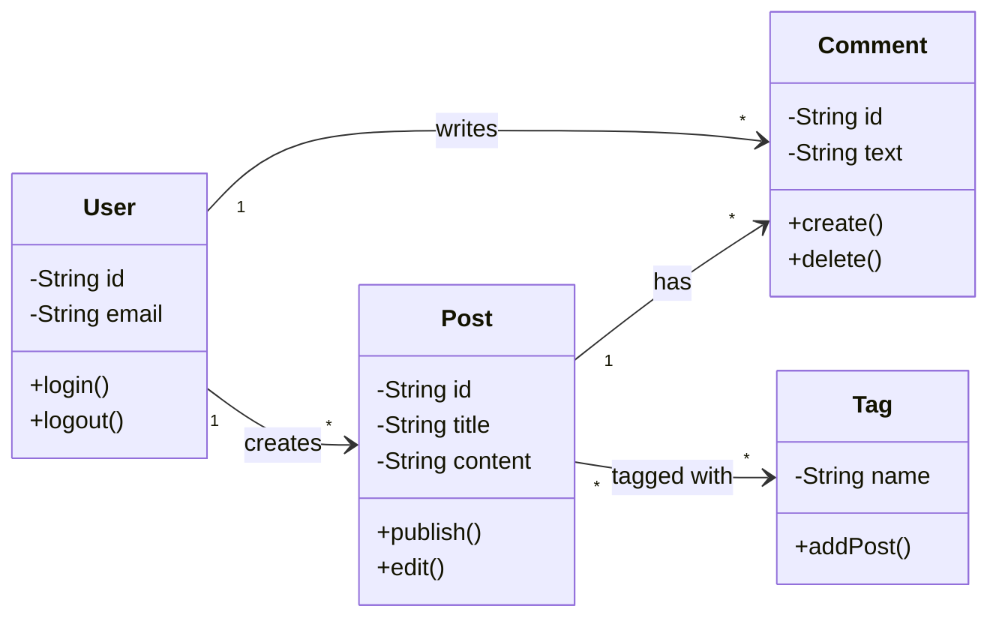
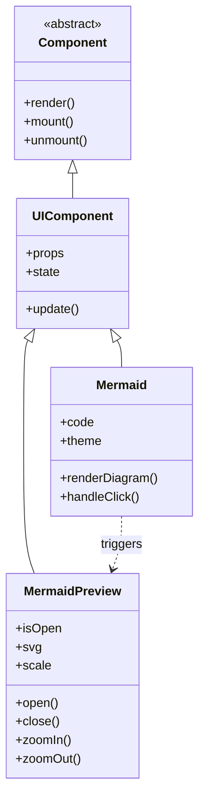
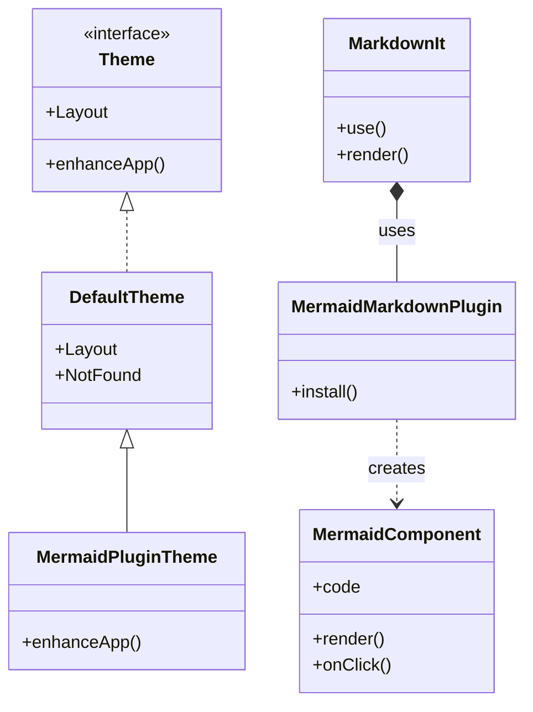
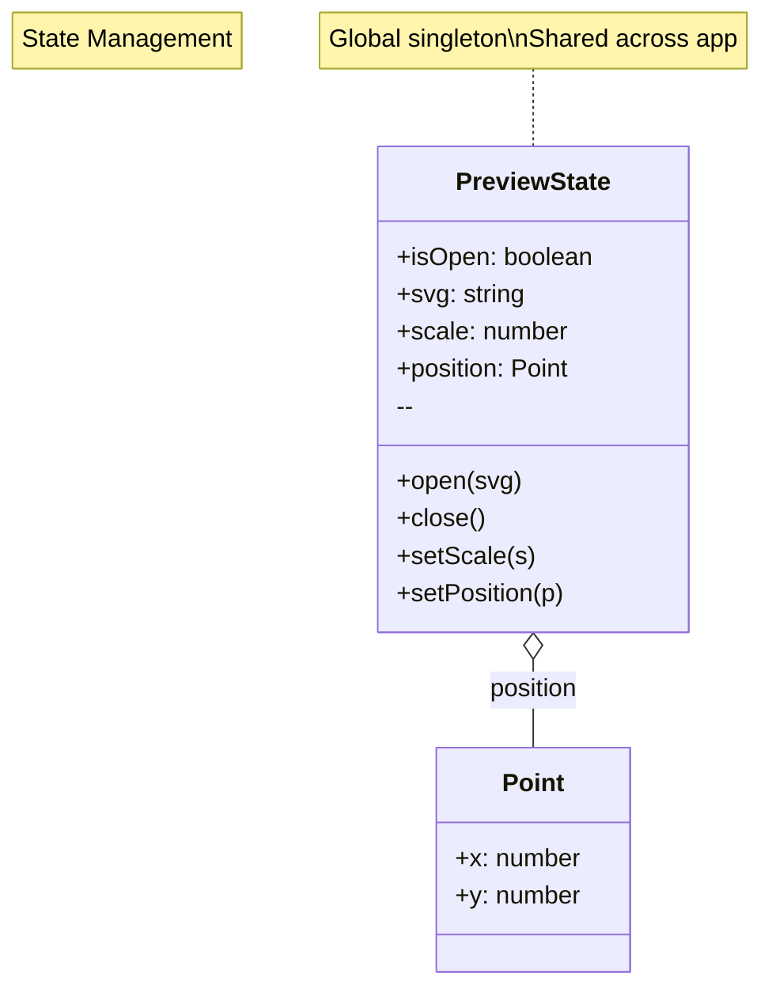

# Class Diagram Examples

Class diagrams illustrate the structure of object-oriented systems.

## Basic Class Diagram

## With Relationships

## Complex Hierarchy

## VitePress Plugin System

## With Annotations

**Click any diagram for fullscreen preview!**
