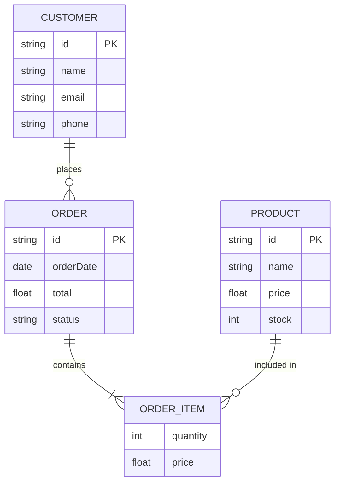
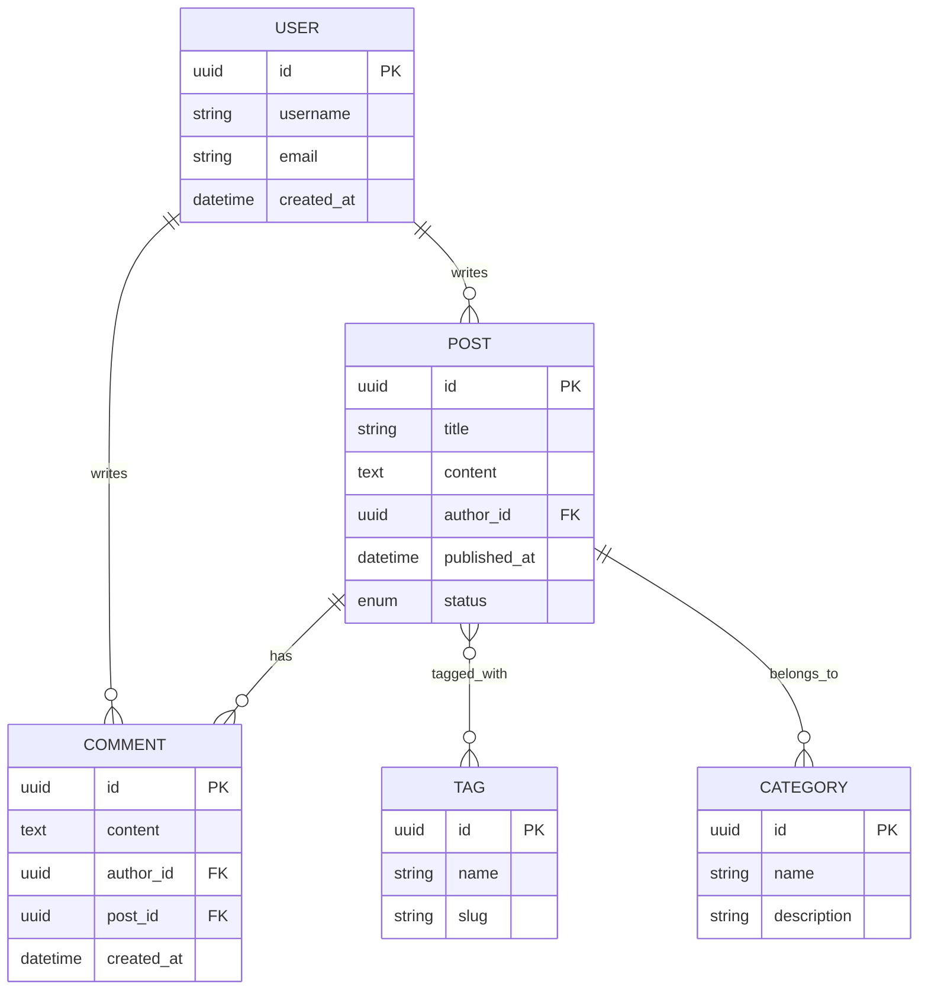
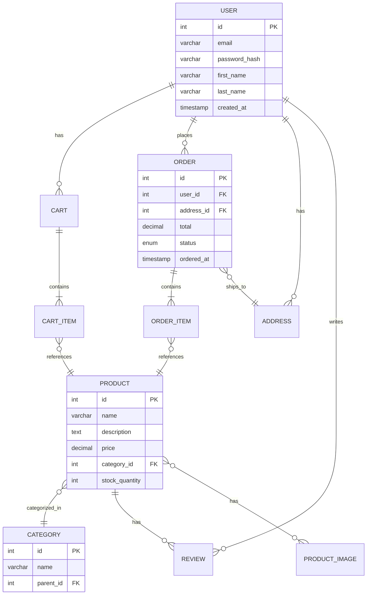
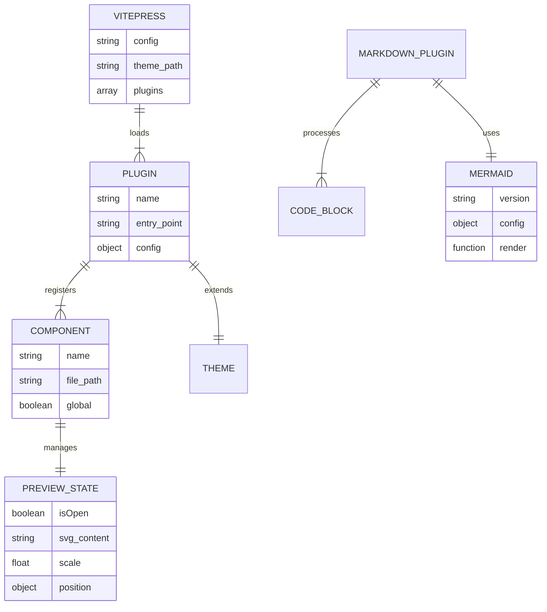

# ER Diagram Examples

Entity-Relationship diagrams show the relationships between entities in a database.

## Simple ER Diagram

## Blog System

## E-Commerce System

## Plugin Architecture

**Click any diagram for fullscreen preview!**
