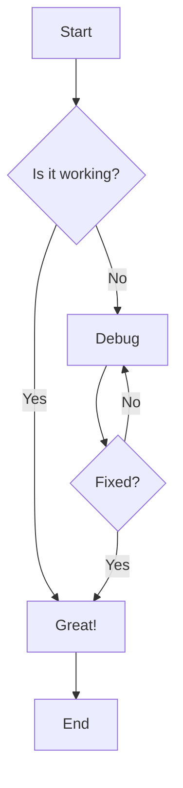
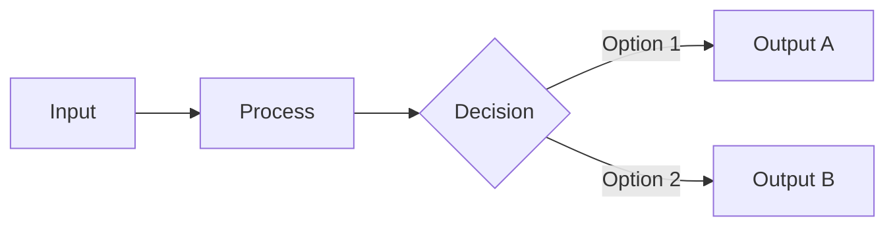
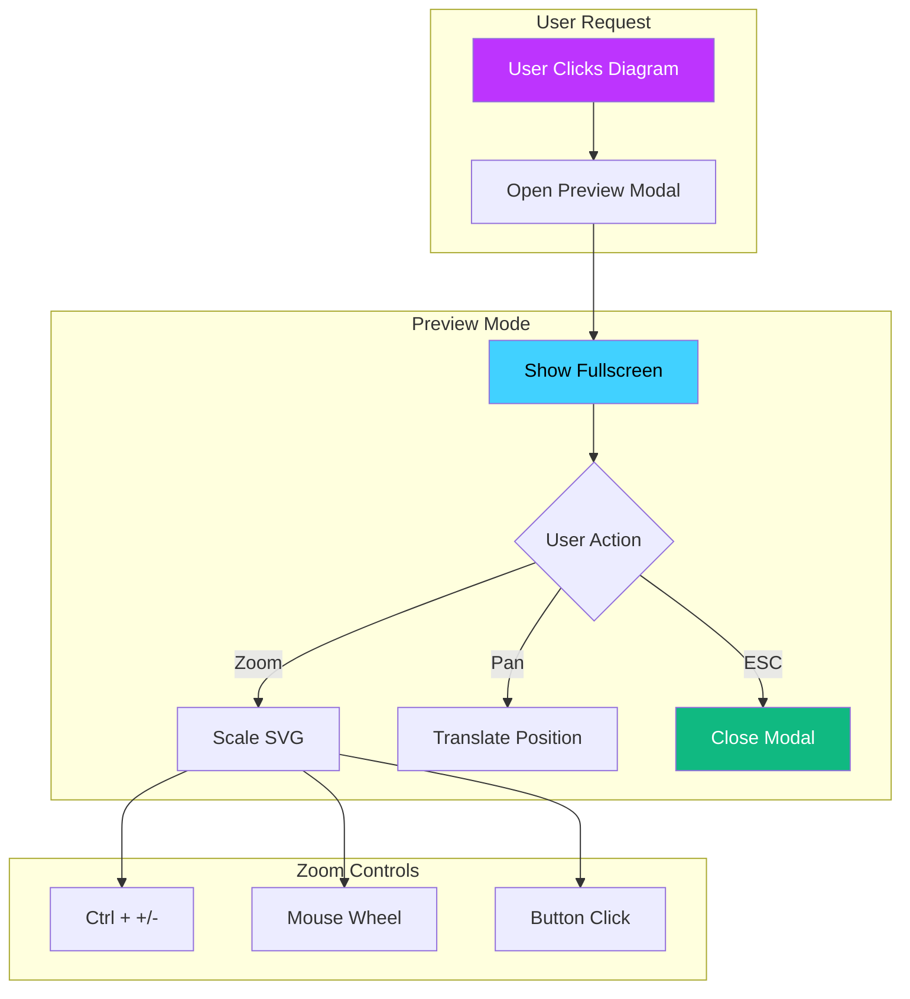
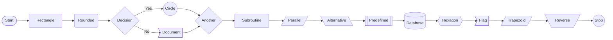
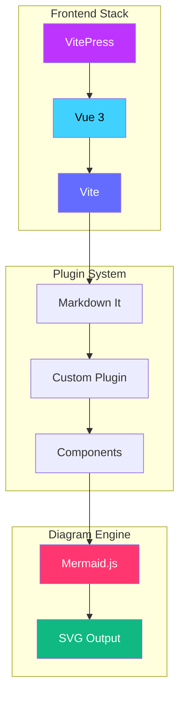

# Flowchart Examples

Flowcharts are perfect for visualizing processes, workflows, and decision trees.

## Basic Flowchart

## LR Direction

Left-to-right flowchart:

## Complex Workflow

A more complex example with styling:

## Node Shapes

Different node types:

## Styled Flowchart

Using custom colors:

**Click any diagram to preview in fullscreen!**
