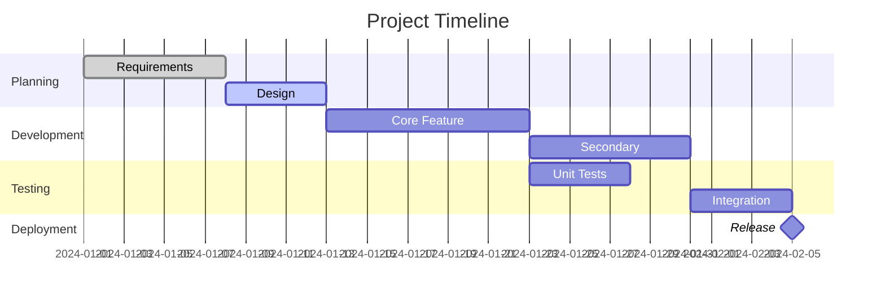
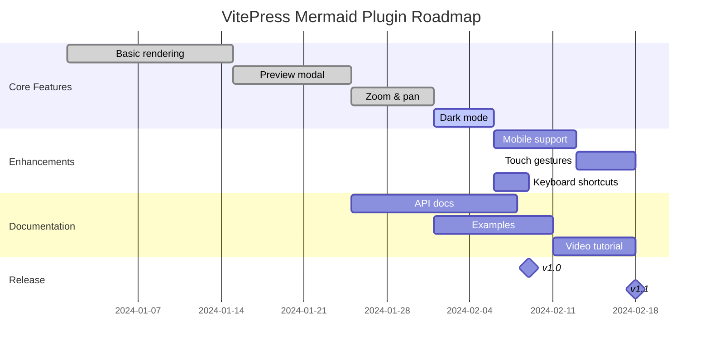
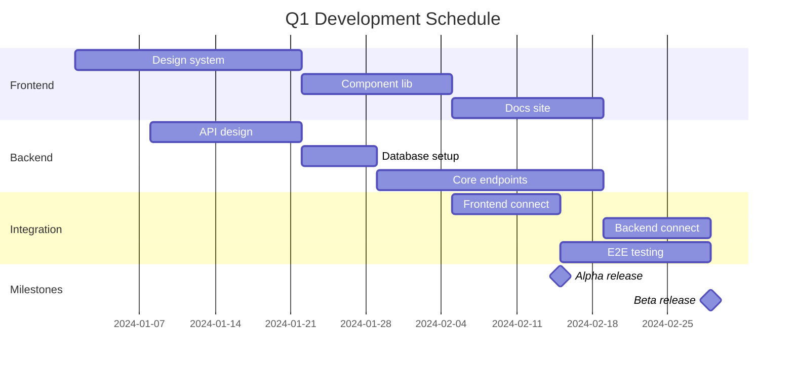
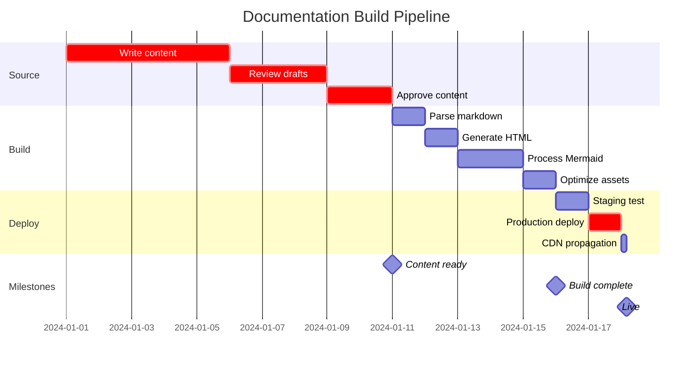
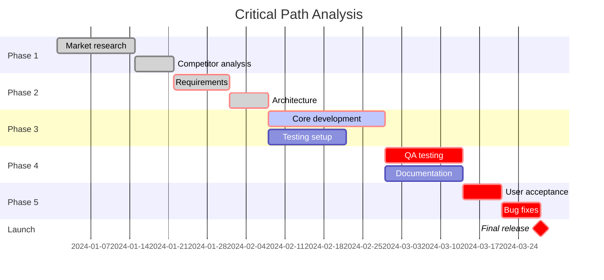

# Gantt Chart Examples

Gantt charts are used for project scheduling and timeline visualization.

## Basic Gantt Chart

## Plugin Development Timeline

## Multi-Project View

## Dependency Tracking

## Critical Path

**Click any chart to view in fullscreen mode!**
