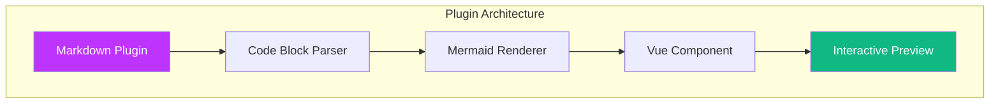

# Examples

Explore various Mermaid diagram types with interactive preview support.

## Available Examples

- [Flowchart](./flowchart.md) - Process flows and workflows
- [Sequence Diagram](./sequence-diagram.md) - Object interactions over time
- [Class Diagram](./class-diagram.md) - Object-oriented structure
- [ER Diagram](./er-diagram.md) - Entity relationships
- [Gantt Chart](./gantt-chart.md) - Project timelines

## Try It Out

Each example page contains multiple diagrams that you can interact with:

1. **Click** on any diagram to open fullscreen preview
2. **Zoom** in to see details
3. **Pan** around by dragging
4. Use **keyboard shortcuts** for quick navigation

## Quick Demo

Here's a sample diagram to try:

**Click the diagram above** to experience the fullscreen preview feature!
