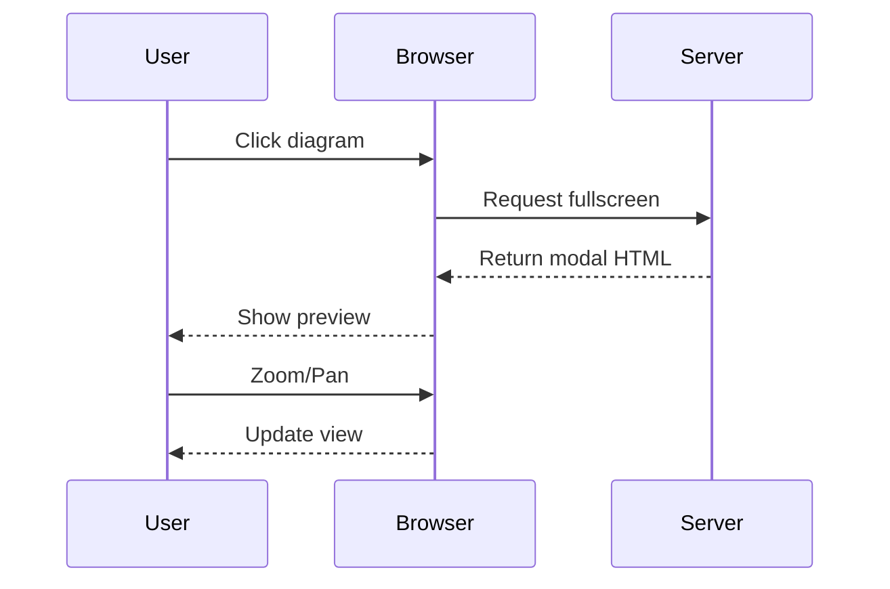
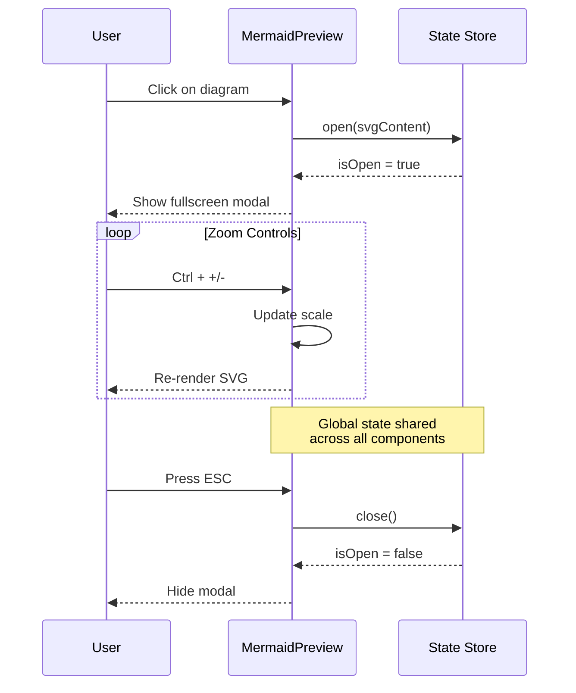
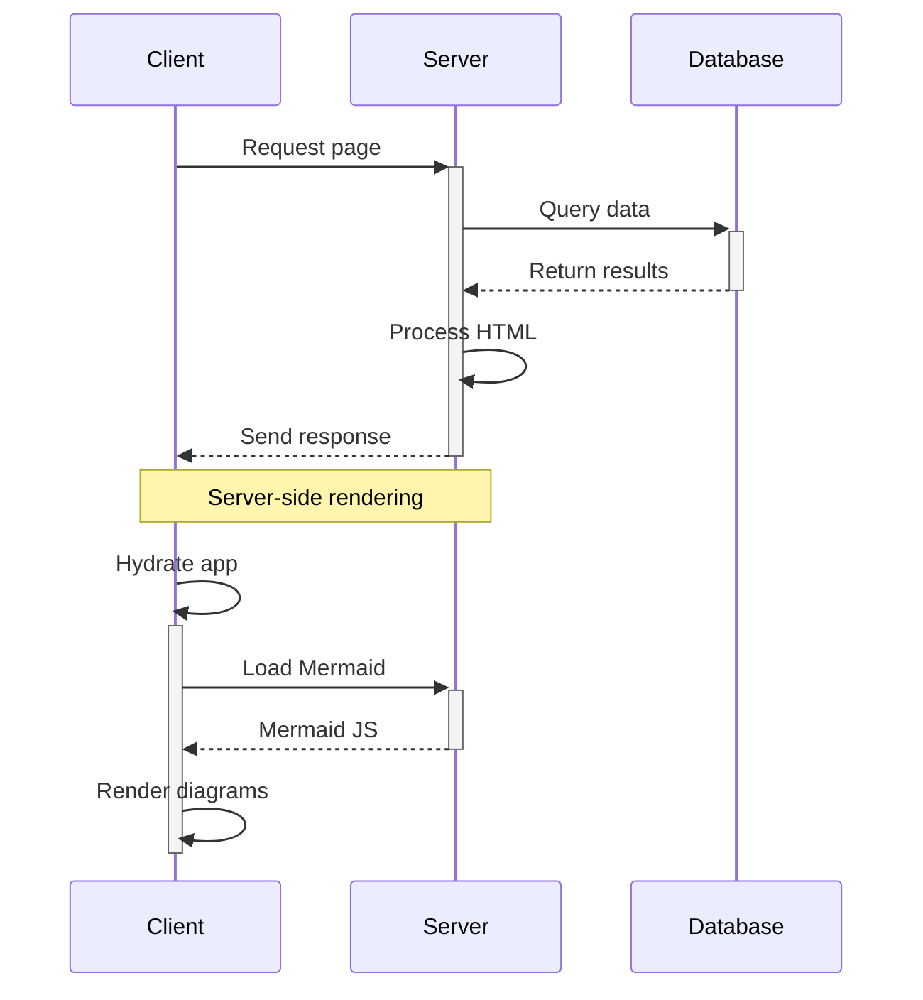
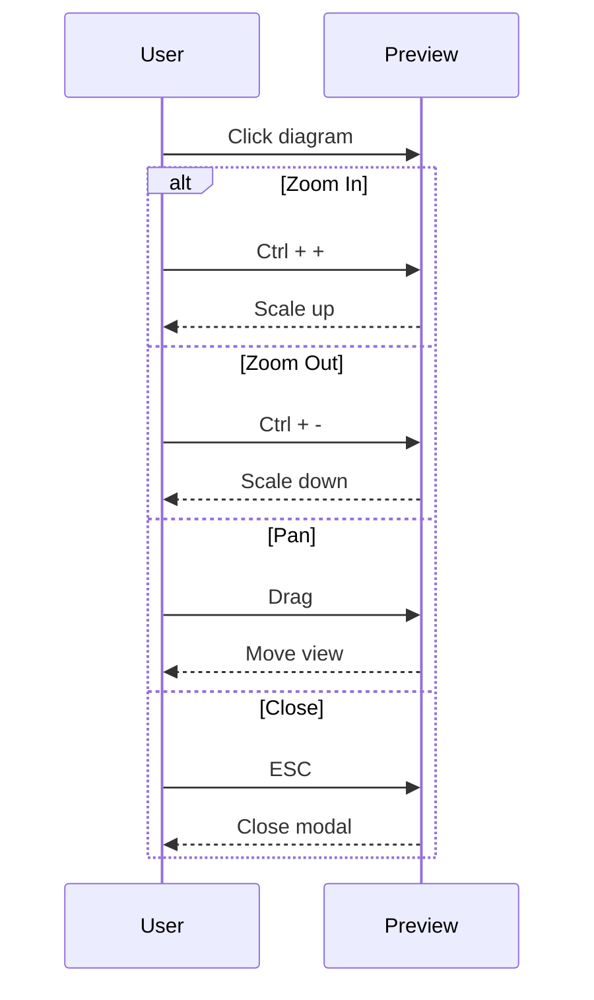
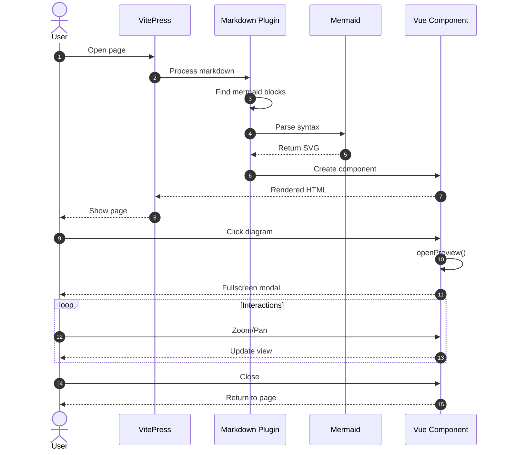

# Sequence Diagram Examples

Sequence diagrams show interactions between objects or participants over time.

## Basic Sequence

## With Loops and Notes

## Activation Boxes

## Alternative Paths

## Complex Example

**Click any diagram to see it in fullscreen!**
