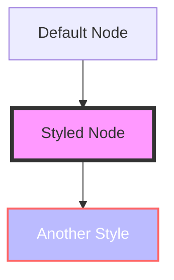

# Configuration

Learn how to customize VitePress Mermaid for your needs.

## Markdown Plugin Options

The `mermaidMarkdownPlugin` function accepts an optional configuration object:

```typescript
import { defineConfig } from 'vitepress';
import { mermaidMarkdownPlugin } from '@unify-js/vitepress-plugin-mermaid/mermaid-markdown';

export default defineConfig({
  markdown: {
    config: md => {
      mermaidMarkdownPlugin(md, {
        // Configuration options
      });
    },
  },
});
```

## Component Props

### Mermaid Component

The `Mermaid` component accepts the following props:

| Prop   | Type     | Default | Description                        |
| ------ | -------- | ------- | ---------------------------------- |
| `code` | `string` | -       | The Mermaid diagram code to render |

Example usage:

```vue
<script setup>
const diagramCode = `
graph TD
  A[Start] --> B[End]
`;
</script>

<template>
  <Mermaid :code="diagramCode" />
</template>
```

### MermaidPreview Component

The `MermaidPreview` component handles the fullscreen preview modal. It's automatically registered when using the theme extension.

## Custom Styling

### CSS Variables

The plugin uses CSS variables that you can override:

```css
/* Custom styles for the preview modal */
.mermaid-preview-modal {
  --preview-bg: rgba(0, 0, 0, 0.9);
  --preview-max-width: 90vw;
  --preview-max-height: 90vh;
}

/* Dark mode adjustments */
.dark .mermaid-preview-modal {
  --preview-bg: rgba(0, 0, 0, 0.95);
}
```

### Styling Mermaid Diagrams

You can style your Mermaid diagrams using Mermaid's built-in styling:



## TypeScript Support

### Type Declarations

The plugin includes TypeScript declarations. If you encounter issues with `.vue` files, ensure your `tsconfig.json` includes:

```json
{
  "compilerOptions": {
    "types": ["vite/client"]
  }
}
```

Or create an `env.d.ts` file:

```typescript
/// <reference types="vite/client" />

declare module '*.vue' {
  import type { DefineComponent } from 'vue';
  const component: DefineComponent<{}, {}, any>;
  export default component;
}
```

## Advanced Configuration

### Custom Theme Integration

If you have a custom VitePress theme, you can integrate the plugin components:

```typescript
import type { Theme } from 'vitepress';
import CustomTheme from './CustomTheme.vue';
import { enhanceAppWithMermaid } from '@unify-js/vitepress-plugin-mermaid';

export default {
  extends: CustomTheme,
  enhanceApp(ctx) {
    // Your custom enhancements
    enhanceAppWithMermaid(ctx);
  }
} as Theme;
```

### Programmatic Control

Use the `useMermaidPreview` composable for programmatic control:

```vue
<script setup>
import { useMermaidPreview } from '@unify-js/vitepress-plugin-mermaid';

const { isOpen, svg, open, close } = useMermaidPreview();

// Open preview with custom SVG
function showDiagram() {
  open('<svg>...</svg>');
}
</script>
```

## Troubleshooting

### Diagrams Not Rendering

1. Ensure the markdown plugin is configured in `.vitepress/config.ts`
2. Check that the theme is properly extended or components are registered
3. Verify Mermaid is installed as a peer dependency

### TypeScript Errors

If you see errors about missing types:

1. Add `"types": ["vite/client"]` to your `tsconfig.json`
2. Create an `env.d.ts` file with Vue declarations
3. Restart your TypeScript language server
