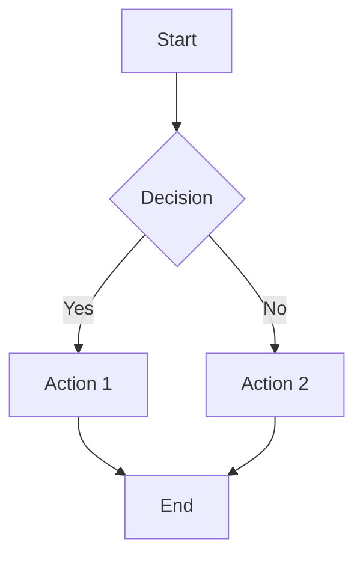
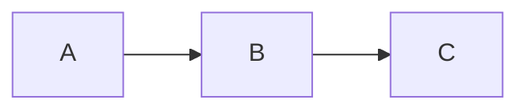

# Getting Started

Get up and running with VitePress Mermaid in minutes.

## Installation

Install the plugin using your preferred package manager:

::: code-group

```bash [pnpm]
pnpm add -D @unify-js/vitepress-mermaid
```

```bash [npm]
npm install -D @unify-js/vitepress-mermaid
```

```bash [yarn]
yarn add -D @unify-js/vitepress-mermaid
```

:::

## Dependency Requirements

This custom theme requires the following dependencies to work properly. Please make sure they are installed:

```bash
pnpm add -D vitepress mermaid
```

## Configuration

### Step 1: Configure VitePress Config

Create or edit your `.vitepress/config.ts` file:

```typescript
import { defineConfig } from 'vitepress';
import { withMermaidConfig } from '@unify-js/vitepress-mermaid/config';

export default withMermaidConfig(
  defineConfig({
    // Your VitePress config
  })
);
```

### Step 2: Configure the Theme

Create or edit your `.vitepress/theme/index.ts` file:

```typescript
import type { Theme } from 'vitepress';
import { MermaidTheme } from '@unify-js/vitepress-mermaid';

export default {
  extends: MermaidTheme,
} satisfies Theme;
```

## Usage

Once configured, you can use Mermaid diagrams in your Markdown files:

````markdown

````

This will render as:


**Click on the diagram above** to open the fullscreen preview!

## Displaying Source Code

Use `mermaid-example` to show both the diagram and its source code:

````markdown

````


## Next Steps

- Learn about [development details](./development.md)
- See more [usage examples](./usage.md)
- Check out [keyboard shortcuts](./shortcuts.md)
- Explore [diagram examples](../examples/)
