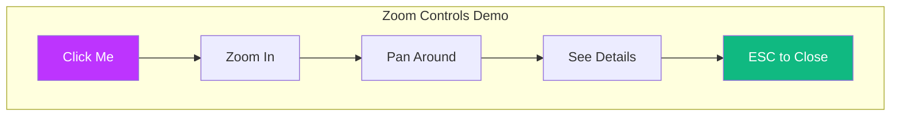

# Keyboard Shortcuts

VitePress Mermaid provides intuitive keyboard shortcuts for efficient diagram navigation.

## Available Shortcuts

| Shortcut | Action | Description |
|----------|--------|-------------|
| `ESC` | Close Preview | Closes the fullscreen preview modal |
| `Ctrl/Cmd + +` | Zoom In | Increases the zoom level |
| `Ctrl/Cmd + -` | Zoom Out | Decreases the zoom level |
| `Ctrl/Cmd + 0` | Reset Zoom | Resets to the original zoom level |

## Mouse Interactions

| Action | Function |
|--------|----------|
| **Click** diagram | Opens fullscreen preview |
| **Scroll wheel** | Zoom in/out at cursor position |
| **Drag** | Pan around when zoomed in |
| **Click X button** | Close preview |
| **Click backdrop** | Close preview |

## Touch Gestures (Mobile)

| Gesture | Function |
|---------|----------|
| **Tap** diagram | Opens fullscreen preview |
| **Pinch** | Zoom in/out |
| **Swipe** | Pan around when zoomed in |
| **Tap X button** | Close preview |

## Usage Examples

### Quick Navigation

1. Click on a diagram to open it
2. Use `Ctrl + +` several times to zoom in
3. Drag to pan to the area of interest
4. Press `ESC` to close when done

### Detailed Examination

**Try the shortcuts on the diagram above!**

## Zoom Levels

The preview supports a wide range of zoom levels:

- **Minimum**: 0.1x (10% of original size)
- **Maximum**: 5x (500% of original size)
- **Step**: 0.1x increments

## Accessibility

All keyboard shortcuts are designed to be:

- **Discoverable** - Shown in the UI
- **Consistent** - Match common patterns (e.g., browser zoom)
- **Non-intrusive** - Don't interfere with page navigation

### Focus Management

When the preview opens:
- Focus moves to the modal container
- `Tab` navigation is trapped within the modal
- Pressing `ESC` returns focus to the trigger element

## Customization

Currently, keyboard shortcuts are fixed for consistency. Future versions may allow customization through configuration.

## Tips

1. **Zoom before panning** - Zoom in first, then drag to explore
2. **Use keyboard for precision** - Keyboard shortcuts offer finer control than scroll
3. **Reset when lost** - `Ctrl/Cmd + 0` quickly returns to the full view
4. **ESC is your friend** - The fastest way to close and continue reading
