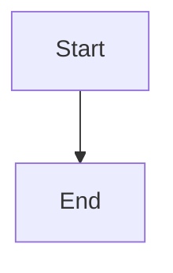
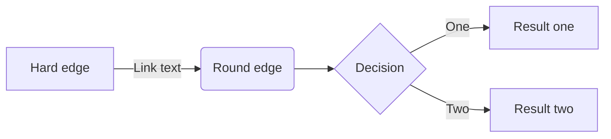
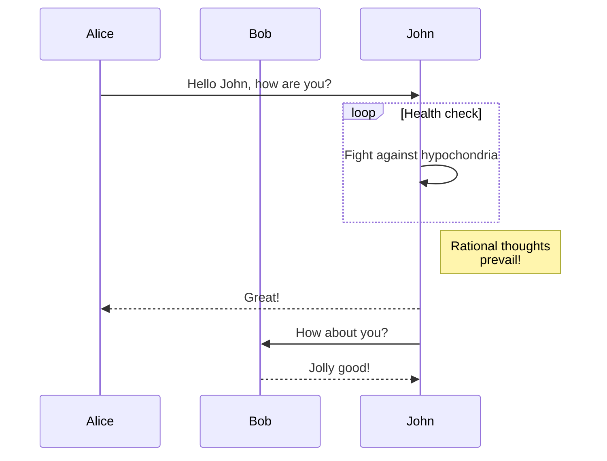
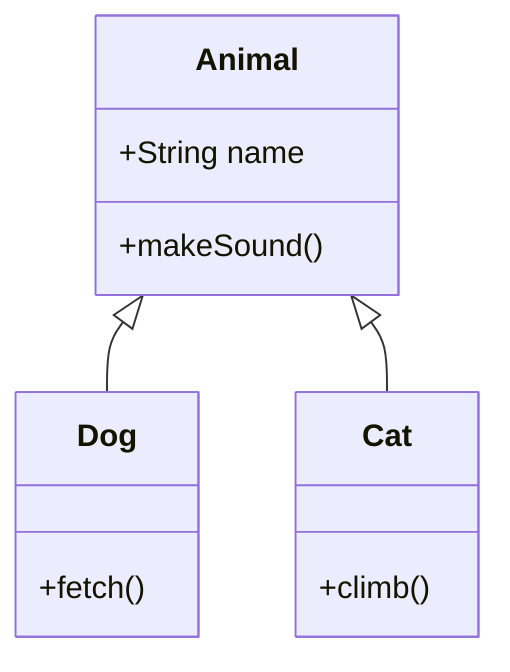
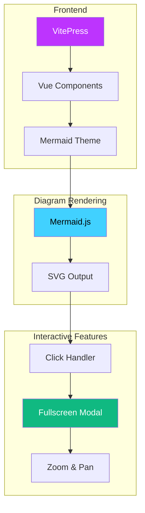
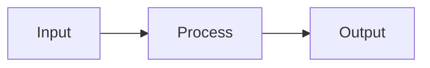
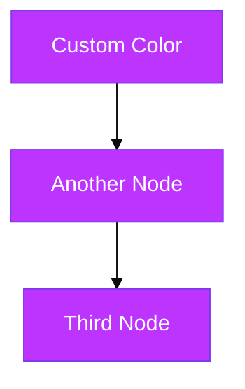
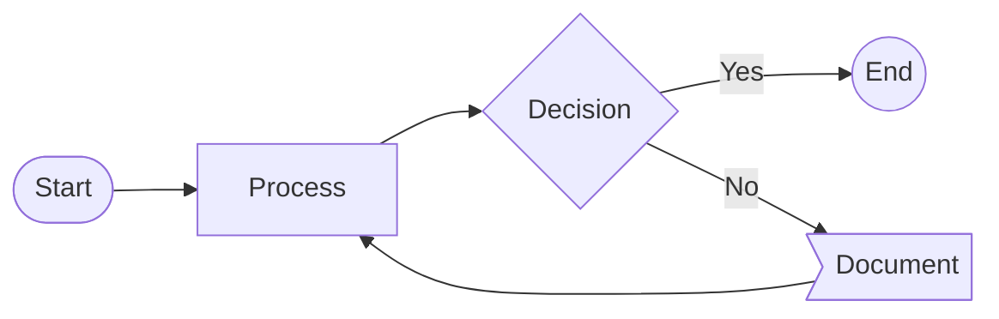

# Usage Guide

Learn how to create and customize Mermaid diagrams in your VitePress documentation.

## Basic Syntax

Mermaid diagrams are created using code blocks with the `mermaid` language identifier:

````markdown

````


## Diagram Types

### Flowchart

Flowcharts are great for visualizing processes and workflows:

````markdown

````


### Sequence Diagram

Sequence diagrams show interactions between entities:

````markdown

````


### Class Diagram

Class diagrams for object-oriented design:

````markdown

````


## Interactive Preview

### How to Use

1. **Click** on any diagram in your documentation
2. The diagram opens in **fullscreen mode**
3. Use your **mouse wheel** or **keyboard** to zoom
4. **Drag** to pan around the diagram
5. Press **ESC** or click the **X** to close

### Example: Complex Diagram

Try interacting with this larger diagram:



**Click the diagram above to explore it in fullscreen!**

## Show Source Code

Use `mermaid-example` to display both the diagram and its source:

````markdown

````


## Styling Tips

### Colors and Themes

Mermaid diagrams automatically adapt to your VitePress theme:



### Node Shapes

Different node shapes for different purposes:



## Best Practices

1. **Keep diagrams focused** - One concept per diagram
2. **Use meaningful labels** - Clear and concise text
3. **Consistent styling** - Use colors purposefully
4. **Test interactions** - Click your diagrams to ensure they work
5. **Consider mobile** - Large diagrams may need zooming on small screens

## Next Steps

- Explore more [diagram examples](../examples/)
- Learn [keyboard shortcuts](./shortcuts.md)
- Check the [API reference](../api/)
