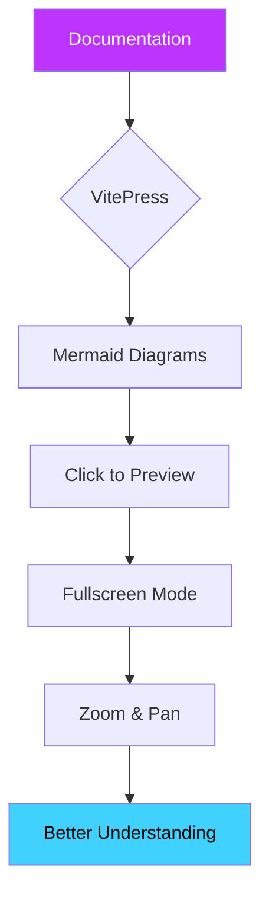

# VitePress Mermaid

A powerful VitePress plugin that brings interactive Mermaid diagram preview to your documentation.

## What is it?

**VitePress Mermaid** enhances your documentation by adding interactive preview capabilities to Mermaid diagrams. When readers click on a diagram, it opens in a fullscreen modal where they can:

- **Zoom** in and out to see details
- **Pan** around large diagrams by dragging
- Use **keyboard shortcuts** for quick navigation
- Enjoy **smooth animations** and **dark mode** support

## Quick Preview

Click on the diagram below to try the preview feature:

## Why Use This Plugin?

| Feature                | Benefit                                   |
| ---------------------- | ----------------------------------------- |
| **Fullscreen Preview** | View complex diagrams without scrolling   |
| **Zoom Controls**      | Examine details in large diagrams         |
| **Pan/Drag**           | Navigate around extensive diagrams easily |
| **Keyboard Shortcuts** | Quick and efficient control               |
| **Dark Mode**          | Seamless theme switching                  |
| **Mobile Support**     | Touch gestures on mobile devices          |

## Next Steps

- **[Getting Started](./guide/getting-started.md)** - Install and configure the plugin
- **[Configuration](./guide/configuration.md)** - Customize the plugin to your needs
- **[Examples](./examples/)** - See various diagram types in action
