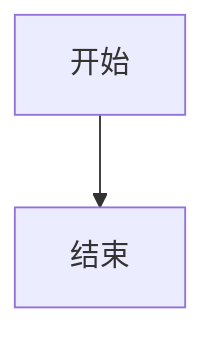
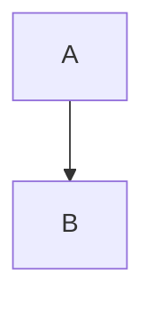

# Markdown 插件

将 Mermaid 代码块转换为交互式组件的 markdown-it 插件。

## 导入

```typescript
import { mermaidMarkdownPlugin } from '@unify-js/vitepress-plugin-mermaid/mermaid-markdown'
// 或
import { mermaidMarkdownPlugin } from '@unify-js/vitepress-plugin-mermaid'
```

## 配置

### 基础设置

```typescript
// .vitepress/config.ts
import { defineConfig } from 'vitepress'
import { mermaidMarkdownPlugin } from '@unify-js/vitepress-plugin-mermaid/mermaid-markdown'

export default defineConfig({
  markdown: {
    config: (md) => {
      mermaidMarkdownPlugin(md)
    }
  }
})
```

## 支持的代码块

### `mermaid`

标准 Mermaid 代码块被渲染为交互式图表：

````markdown

````

### `mermaid-example`

同时显示图表及其源代码：

````markdown

````

这会渲染为：
- 可点击预览的 Mermaid 图表
- 显示源代码的代码块

## 工作原理

该插件在构建过程中处理 Markdown 代码块：

1. **扫描** - 识别 `mermaid` 和 `mermaid-example` 代码块
2. **转换** - 将它们替换为 Vue 组件标签
3. **渲染** - Mermaid 组件处理客户端渲染

### 之前（Markdown）

````markdown

````

### 之后（HTML）

```html
<Mermaid code="graph TD; A --> B;" />
```

## 与 VitePress 集成

该插件专为 VitePress 设计，并：

- 与 VitePress 的 Markdown 管道配合工作
- 尊重 VitePress 的主题设置
- 在开发模式下支持热模块替换
- 与其他 Markdown 插件兼容

## 自定义

目前，插件使用默认设置工作。未来版本可能支持：

- 自定义块类型
- 渲染选项
- 主题配置
- 错误处理自定义

## 错误处理

当图表渲染失败时：

1. 错误会记录到控制台
2. 显示回退消息
3. 页面上的其他图表继续正常工作

错误显示示例：

```
[Mermaid 错误]
第 2 行解析错误：
graph TD  invalid_syntax
--------------^
期望 'SPACE', 'GRAPH', 得到 'ALPHA'
```
