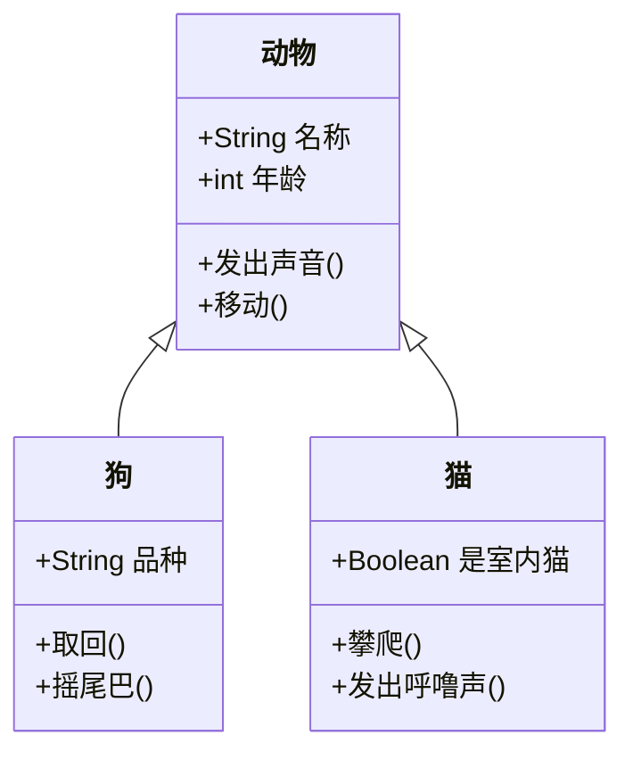
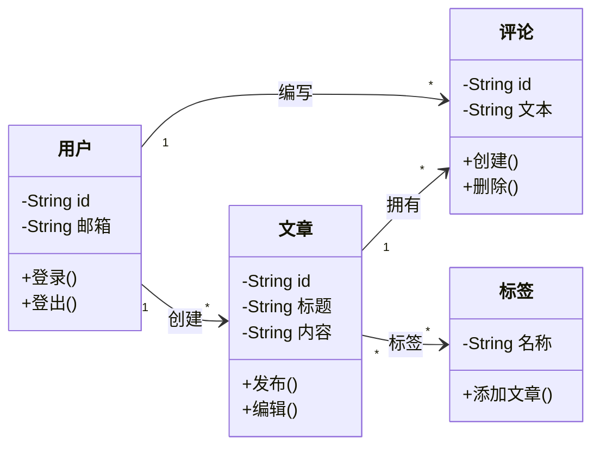
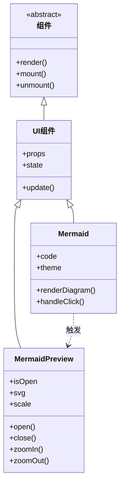
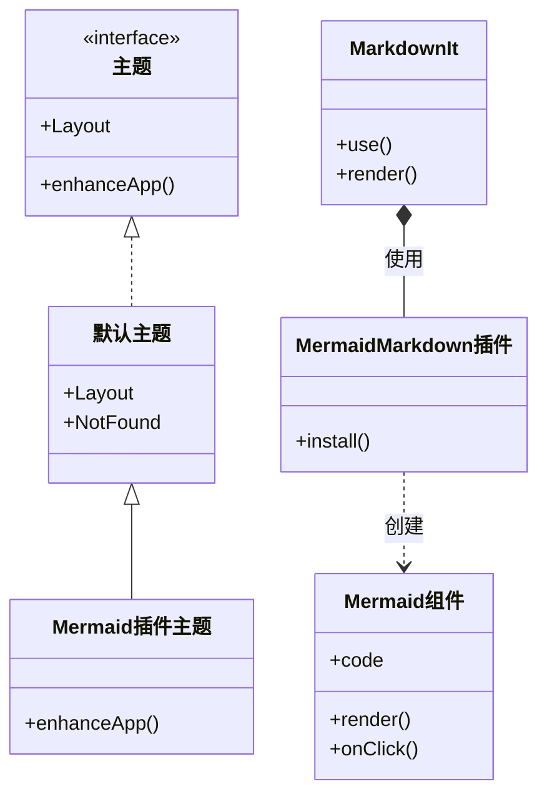
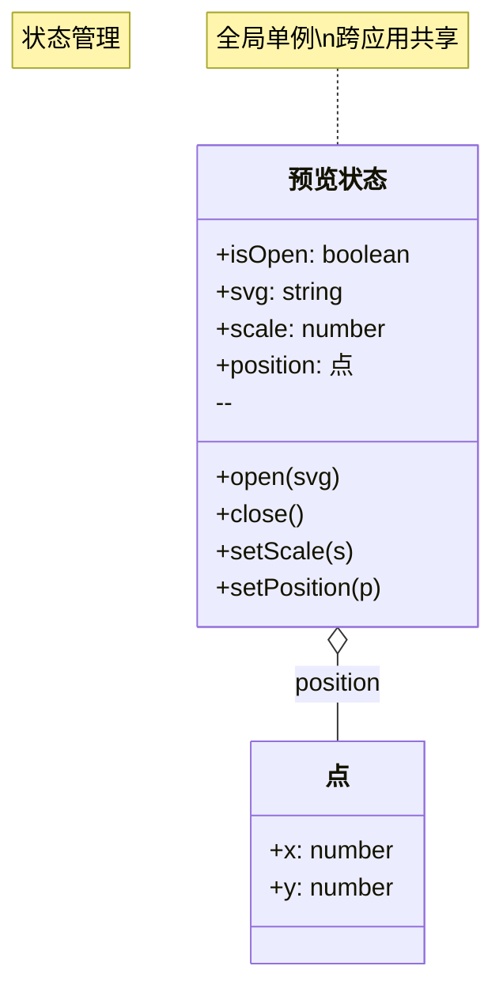

# 类图示例

类图展示面向对象系统的结构。

## 基础类图

```mermaid
classDiagram
    class 动物 {
        +String 名称
        +int 年龄
        +发出声音()
        +移动()
    }

    class 狗 {
        +String 品种
        +取回()
        +摇尾巴()
    }

    class 猫 {
        +Boolean 是室内猫
        +攀爬()
        +发出呼噜声()
    }

    动物 <|-- 狗
    动物 <|-- 猫
```

## 带关系

```mermaid
classDiagram
    direction LR

    class 用户 {
        -String id
        -String 邮箱
        +登录()
        +登出()
    }

    class 文章 {
        -String id
        -String 标题
        -String 内容
        +发布()
        +编辑()
    }

    class 评论 {
        -String id
        -String 文本
        +创建()
        +删除()
    }

    class 标签 {
        -String 名称
        +添加文章()
    }

    用户 "1" --> "*" 文章 : 创建
    用户 "1" --> "*" 评论 : 编写
    文章 "1" --> "*" 评论 : 拥有
    文章 "*" --> "*" 标签 : 标签
```

## 复杂层次结构

```mermaid
classDiagram
    class 组件 {
        <<abstract>>
        +render()
        +mount()
        +unmount()
    }

    class UI组件 {
        +props
        +state
        +update()
    }

    class Mermaid {
        +code
        +theme
        +renderDiagram()
        +handleClick()
    }

    class MermaidPreview {
        +isOpen
        +svg
        +scale
        +open()
        +close()
        +zoomIn()
        +zoomOut()
    }

    组件 <|-- UI组件
    UI组件 <|-- Mermaid
    UI组件 <|-- MermaidPreview

    Mermaid ..> MermaidPreview : 触发
```

## VitePress 插件系统

```mermaid
classDiagram
    class 主题 {
        <<interface>>
        +Layout
        +enhanceApp()
    }

    class 默认主题 {
        +Layout
        +NotFound
    }

    class Mermaid插件主题 {
        +enhanceApp()
    }

    class MarkdownIt {
        +use()
        +render()
    }

    class MermaidMarkdown插件 {
        +install()
    }

    class Mermaid组件 {
        +code
        +render()
        +onClick()
    }

    主题 <|.. 默认主题
    默认主题 <|-- Mermaid插件主题
    MarkdownIt *-- MermaidMarkdown插件 : 使用
    MermaidMarkdown插件 ..> Mermaid组件 : 创建
```

## 带注释

```mermaid
classDiagram
    note "状态管理"

    class 预览状态 {
        +isOpen: boolean
        +svg: string
        +scale: number
        +position: 点
        --
        +open(svg)
        +close()
        +setScale(s)
        +setPosition(p)
    }

    class 点 {
        +x: number
        +y: number
    }

    预览状态 o-- 点 : position

    note for 预览状态 "全局单例\n跨应用共享"
```

**点击任意图表以全屏预览！**
