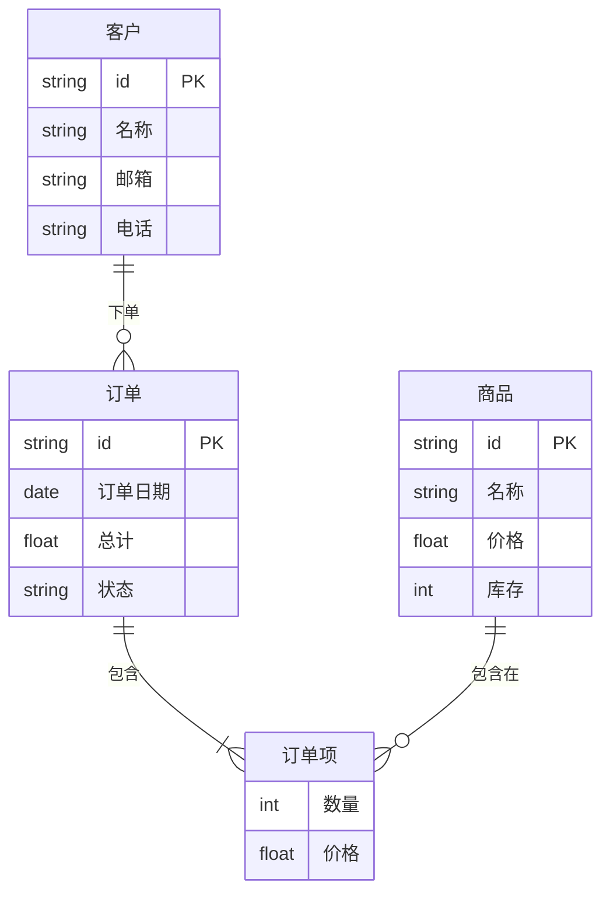
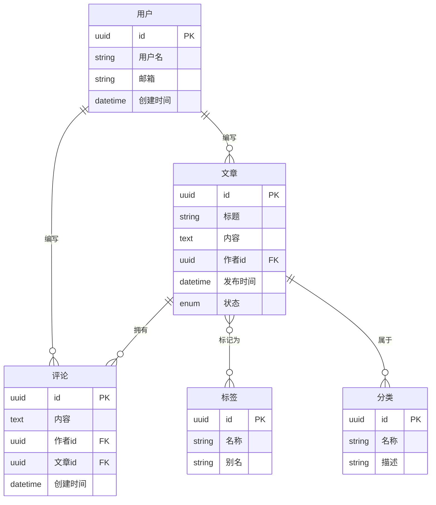
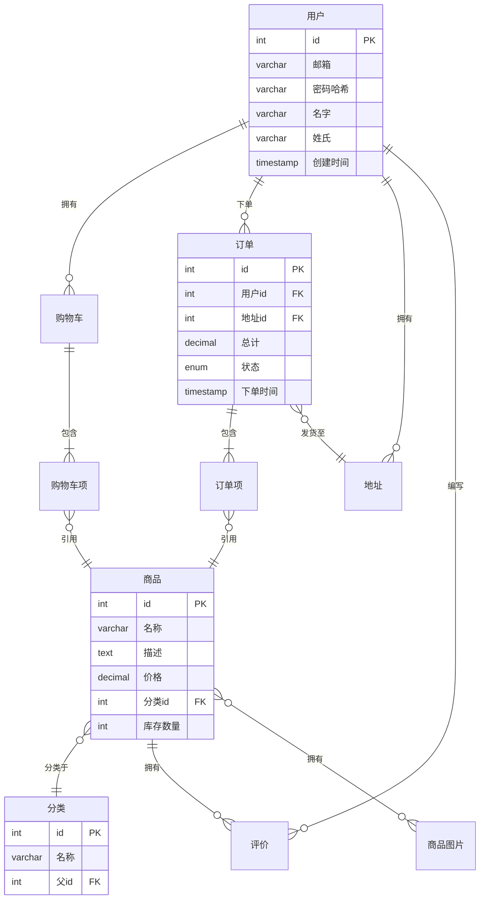
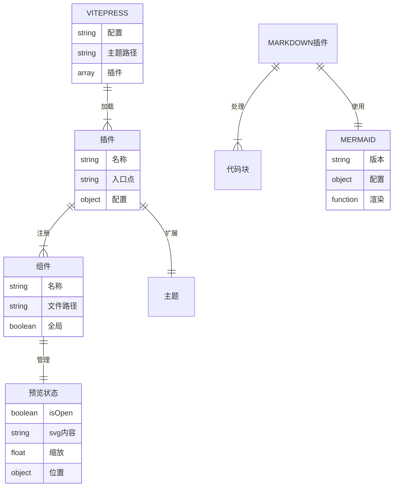

# ER 图示例

实体关系图展示数据库中实体之间的关系。

## 简单 ER 图

```mermaid
erDiagram
    客户 ||--o{ 订单 : 下单
    客户 {
        string id PK
        string 名称
        string 邮箱
        string 电话
    }

    订单 ||--|{ 订单项 : 包含
    订单 {
        string id PK
        date 订单日期
        float 总计
        string 状态
    }

    订单项 {
        int 数量
        float 价格
    }

    商品 ||--o{ 订单项 : "包含在"
    商品 {
        string id PK
        string 名称
        float 价格
        int 库存
    }
```

## 博客系统

```mermaid
erDiagram
    用户 ||--o{ 文章 : 编写
    用户 ||--o{ 评论 : 编写
    文章 ||--o{ 评论 : 拥有
    文章 }o--o{ 标签 : 标记为
    文章 ||--o{ 分类 : 属于

    用户 {
        uuid id PK
        string 用户名
        string 邮箱
        datetime 创建时间
    }

    文章 {
        uuid id PK
        string 标题
        text 内容
        uuid 作者id FK
        datetime 发布时间
        enum 状态
    }

    评论 {
        uuid id PK
        text 内容
        uuid 作者id FK
        uuid 文章id FK
        datetime 创建时间
    }

    标签 {
        uuid id PK
        string 名称
        string 别名
    }

    分类 {
        uuid id PK
        string 名称
        string 描述
    }
```

## 电商系统

```mermaid
erDiagram
    用户 ||--o{ 购物车 : 拥有
    用户 ||--o{ 订单 : 下单
    用户 ||--o{ 地址 : 拥有
    用户 ||--o{ 评价 : 编写

    购物车 ||--|{ 购物车项 : 包含
    购物车项 }o--|| 商品 : 引用

    订单 ||--|{ 订单项 : 包含
    订单 }o--|| 地址 : 发货至
    订单项 }o--|| 商品 : 引用

    商品 }o--|| 分类 : 分类于
    商品 ||--o{ 评价 : 拥有
    商品 }o--o{ 商品图片 : 拥有

    用户 {
        int id PK
        varchar 邮箱
        varchar 密码哈希
        varchar 名字
        varchar 姓氏
        timestamp 创建时间
    }

    商品 {
        int id PK
        varchar 名称
        text 描述
        decimal 价格
        int 分类id FK
        int 库存数量
    }

    分类 {
        int id PK
        varchar 名称
        int 父id FK
    }

    订单 {
        int id PK
        int 用户id FK
        int 地址id FK
        decimal 总计
        enum 状态
        timestamp 下单时间
    }
```

## 插件架构

```mermaid
erDiagram
    VITEPRESS ||--|{ 插件 : 加载
    插件 ||--|{ 组件 : 注册
    插件 ||--|| 主题 : 扩展

    MARKDOWN插件 ||--|{ 代码块 : 处理
    MARKDOWN插件 ||--|| MERMAID : 使用

    组件 ||--|| 预览状态 : 管理

    VITEPRESS {
        string 配置
        string 主题路径
        array 插件
    }

    插件 {
        string 名称
        string 入口点
        object 配置
    }

    组件 {
        string 名称
        string 文件路径
        boolean 全局
    }

    预览状态 {
        boolean isOpen
        string svg内容
        float 缩放
        object 位置
    }

    MERMAID {
        string 版本
        object 配置
        function 渲染
    }
```

**点击任意图表以全屏预览！**
