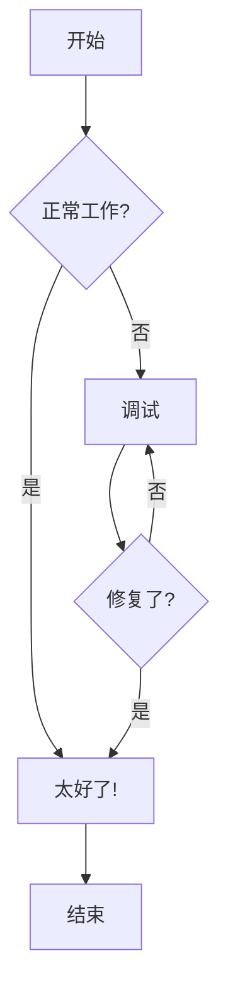
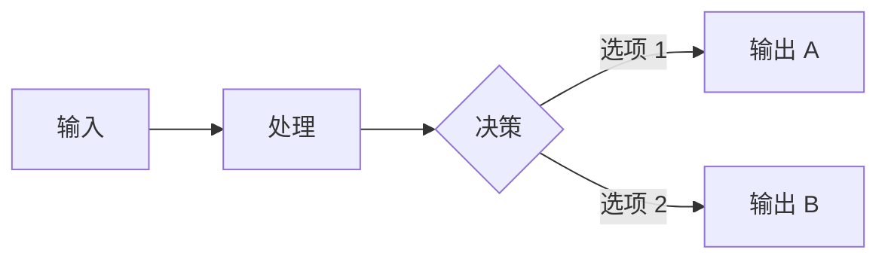
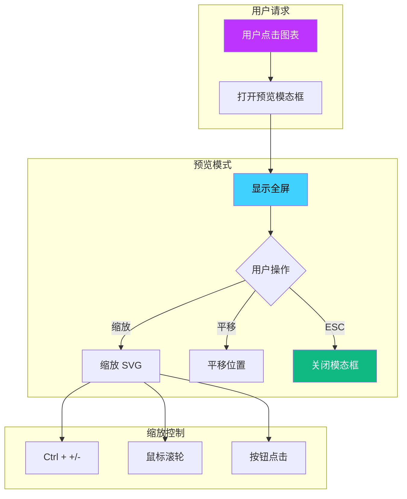
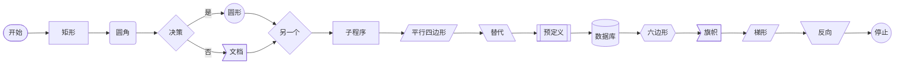
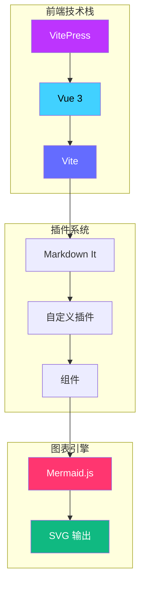

# 流程图示例

流程图非常适合可视化流程、工作流和决策树。

## 基础流程图

```mermaid
graph TD
    A[开始] --> B{正常工作?}
    B -->|是| C[太好了!]
    B -->|否| D[调试]
    D --> E{修复了?}
    E -->|是| C
    E -->|否| D
    C --> F[结束]
```

## 从左到右方向

从左到右的流程图：

```mermaid
graph LR
    A[输入] --> B[处理]
    B --> C{决策}
    C -->|选项 1| D[输出 A]
    C -->|选项 2| E[输出 B]
```

## 复杂工作流

带有样式的更复杂示例：

```mermaid
flowchart TB
    subgraph "用户请求"
        A[用户点击图表] --> B[打开预览模态框]
    end

    subgraph "预览模式"
        B --> C[显示全屏]
        C --> D{用户操作}
        D -->|缩放| E[缩放 SVG]
        D -->|平移| F[平移位置]
        D -->|ESC| G[关闭模态框]
    end

    subgraph "缩放控制"
        E --> H[Ctrl + +/-]
        E --> I[鼠标滚轮]
        E --> J[按钮点击]
    end

    style A fill:#bd34fe,color:#fff
    style C fill:#41d1ff,color:#000
    style G fill:#10b981,color:#fff
```

## 节点形状

不同的节点类型：

```mermaid
graph LR
    A([开始]) --> B[矩形]
    B --> C(圆角)
    C --> D{决策}
    D -->|是| E((圆形))
    D -->|否| F>文档]
    E --> G{另一个}
    F --> G
    G --> H[子程序]
    H --> I[/平行四边形/]
    I --> J[\替代\]
    J --> K[[预定义]]
    K --> L[(数据库)]
    L --> M{{六边形}}
    M --> N>旗帜]
    N --> O[/梯形/]
    O --> P[\反向/]
    P --> Q((停止))
```

## 带样式的流程图

使用自定义颜色：

```mermaid
graph TB
    subgraph "前端技术栈"
        A[VitePress] --> B[Vue 3]
        B --> C[Vite]
    end

    subgraph "插件系统"
        D[Markdown It] --> E[自定义插件]
        E --> F[组件]
    end

    subgraph "图表引擎"
        G[Mermaid.js] --> H[SVG 输出]
    end

    C --> D
    F --> G

    style A fill:#bd34fe,color:#fff
    style B fill:#41d1ff,color:#000
    style C fill:#646cff,color:#fff
    style G fill:#ff3670,color:#fff
    style H fill:#10b981,color:#fff
```

**点击任意图表以全屏预览！**
