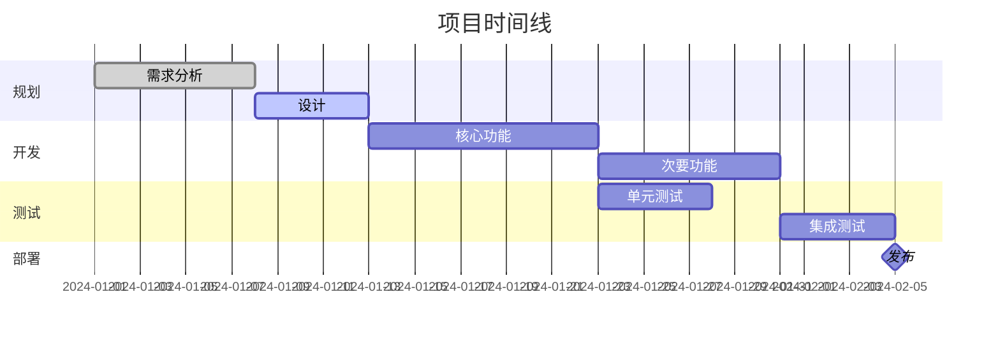
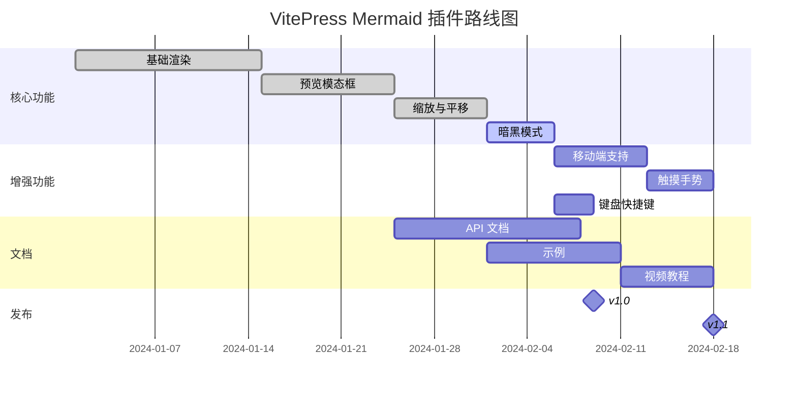
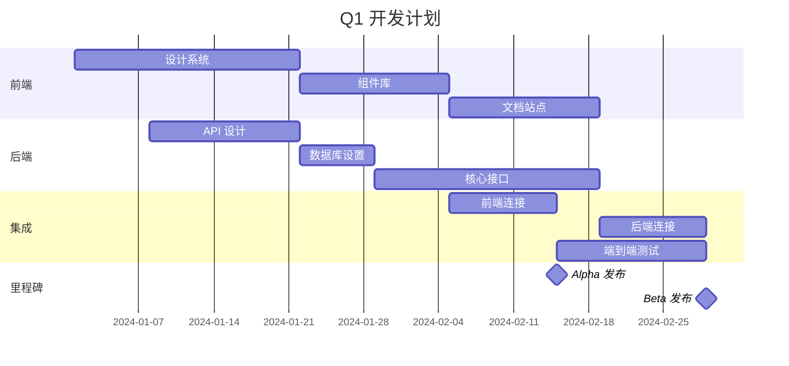
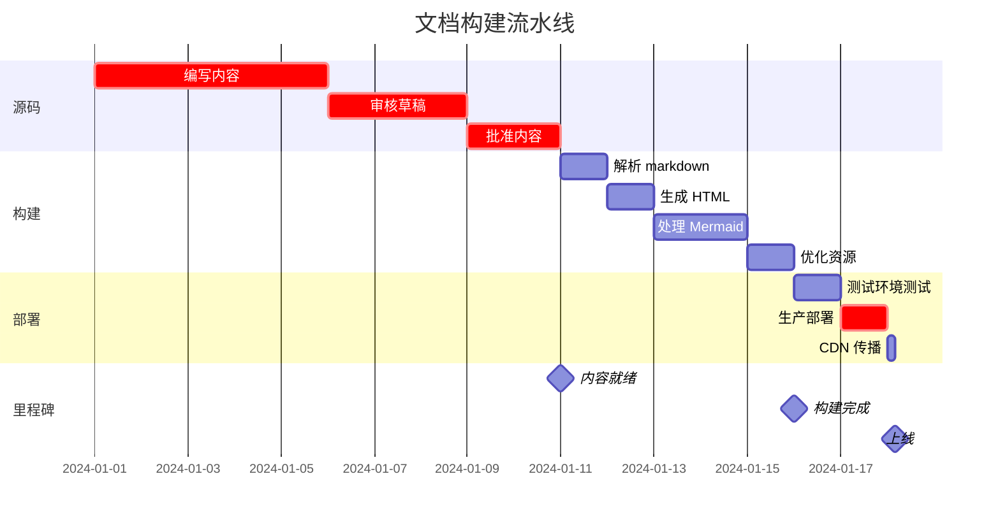
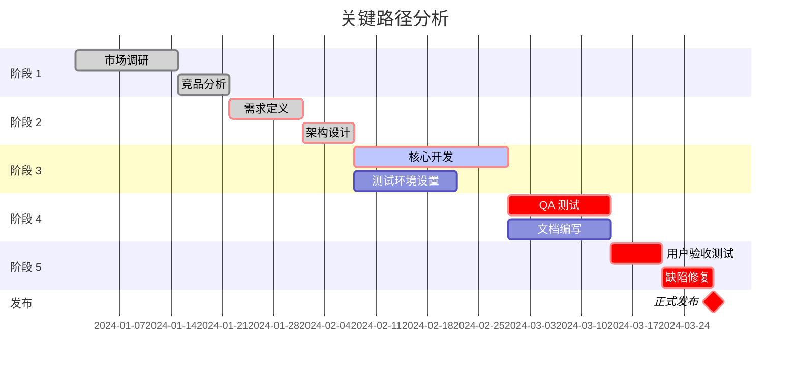

# 甘特图示例

甘特图用于项目调度和时间线可视化。

## 基础甘特图

```mermaid
gantt
    title 项目时间线
    dateFormat  YYYY-MM-DD
    section 规划
    需求分析    :done, req, 2024-01-01, 7d
    设计          :active, des, after req, 5d
    section 开发
    核心功能    :dev1, after des, 10d
    次要功能       :dev2, after dev1, 8d
    section 测试
    单元测试      :test1, after dev1, 5d
    集成测试     :test2, after dev2, 5d
    section 部署
    发布         :milestone, deploy, after test2, 0d
```

## 插件开发时间线

```mermaid
gantt
    title VitePress Mermaid 插件路线图
    dateFormat  YYYY-MM-DD

    section 核心功能
    基础渲染      :done, c1, 2024-01-01, 14d
    预览模态框        :done, c2, after c1, 10d
    缩放与平移           :done, c3, after c2, 7d
    暗黑模式            :active, c4, after c3, 5d

    section 增强功能
    移动端支持       :mob, after c4, 7d
    触摸手势       :touch, after mob, 5d
    键盘快捷键   :key, after c4, 3d

    section 文档
    API 文档             :doc1, after c2, 14d
    示例             :doc2, after c3, 10d
    视频教程       :doc3, after doc2, 7d

    section 发布
    v1.0                 :milestone, v1, after key, 0d
    v1.1                 :milestone, v2, after touch, 0d
```

## 多项目视图

```mermaid
gantt
    dateFormat  YYYY-MM-DD
    title Q1 开发计划

    section 前端
    设计系统      :fs1, 2024-01-01, 21d
    组件库      :fs2, after fs1, 14d
    文档站点          :fs3, after fs2, 14d

    section 后端
    API 设计         :bs1, 2024-01-08, 14d
    数据库设置     :bs2, after bs1, 7d
    核心接口     :bs3, after bs2, 21d

    section 集成
    前端连接   :is1, after fs2, 10d
    后端连接    :is2, after bs3, 10d
    端到端测试        :is3, after is1, 14d

    section 里程碑
    Alpha 发布      :milestone, alpha, after is1, 0d
    Beta 发布       :milestone, beta, after is3, 0d
```

## 依赖跟踪

```mermaid
gantt
    dateFormat  YYYY-MM-DD
    title 文档构建流水线

    section 源码
    编写内容      :crit, s1, 2024-01-01, 5d
    审核草稿      :crit, s2, after s1, 3d
    批准内容    :crit, s3, after s2, 2d

    section 构建
    解析 markdown     :b1, after s3, 1d
    生成 HTML      :b2, after b1, 1d
    处理 Mermaid    :b3, after b2, 2d
    优化资源    :b4, after b3, 1d

    section 部署
    测试环境测试       :d1, after b4, 1d
    生产部署  :crit, d2, after d1, 1d
    CDN 传播    :d3, after d2, 4h

    section 里程碑
    内容就绪      :milestone, m1, after s3, 0d
    构建完成     :milestone, m2, after b4, 0d
    上线               :milestone, m3, after d3, 0d
```

## 关键路径

```mermaid
gantt
    dateFormat  YYYY-MM-DD
    title 关键路径分析

    section 阶段 1
    市场调研    :done, p1a, 2024-01-01, 14d
    竞品分析 :done, p1b, after p1a, 7d

    section 阶段 2
    需求定义       :crit, done, p2a, after p1b, 10d
    架构设计       :crit, done, p2b, after p2a, 7d

    section 阶段 3
    核心开发   :crit, active, p3a, after p2b, 21d
    测试环境设置      :p3b, after p2b, 14d

    section 阶段 4
    QA 测试         :crit, p4a, after p3a, 14d
    文档编写      :p4b, after p3a, 14d

    section 阶段 5
    用户验收测试    :crit, p5a, after p4a, 7d
    缺陷修复          :crit, p5b, after p5a, 7d

    section 发布
    正式发布      :milestone, crit, launch, after p5b, 0d
```

**点击任意图表在全屏模式下查看！**
