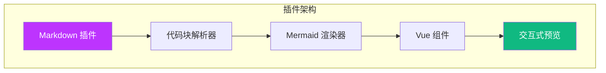

# 示例

探索支持交互式预览的各种 Mermaid 图表类型。

## 可用示例

- [流程图](./flowchart.md) - 流程和工作流
- [时序图](./sequence-diagram.md) - 对象随时间的交互
- [类图](./class-diagram.md) - 面向对象结构
- [ER 图](./er-diagram.md) - 实体关系
- [甘特图](./gantt-chart.md) - 项目时间线

## 试试看

每个示例页面包含多个您可以交互的图表：

1. **点击** 任意图表打开全屏预览
2. **缩放** 查看细节
3. **拖拽** 平移
4. 使用 **键盘快捷键** 快速导航

## 快速演示

这里有一个示例图表可供尝试：

**点击上方图表** 体验全屏预览功能！
