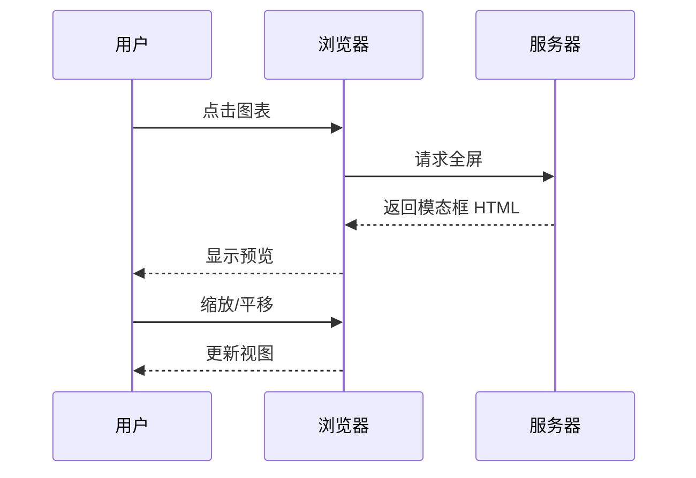
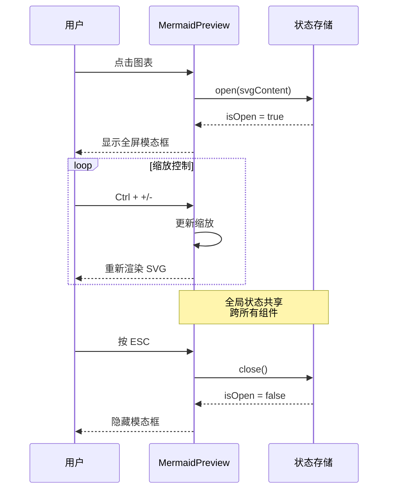
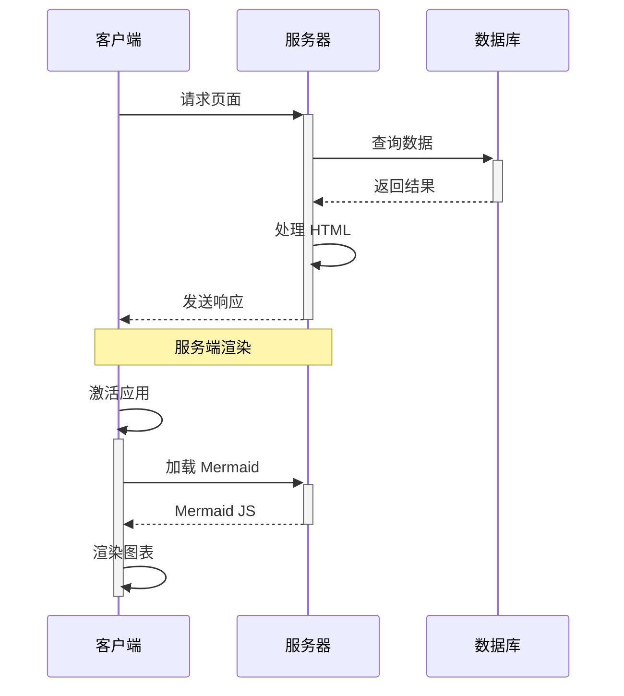
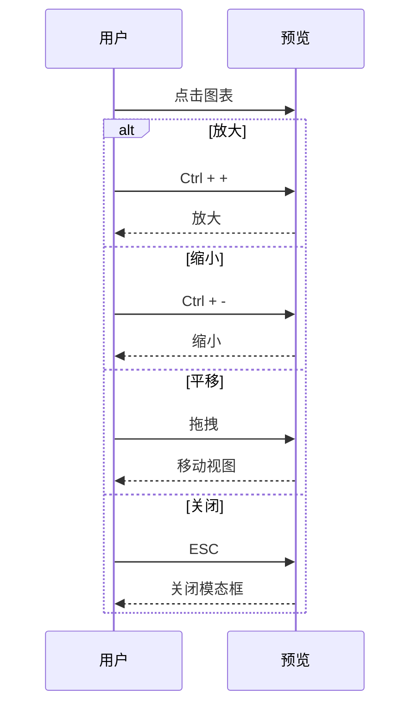
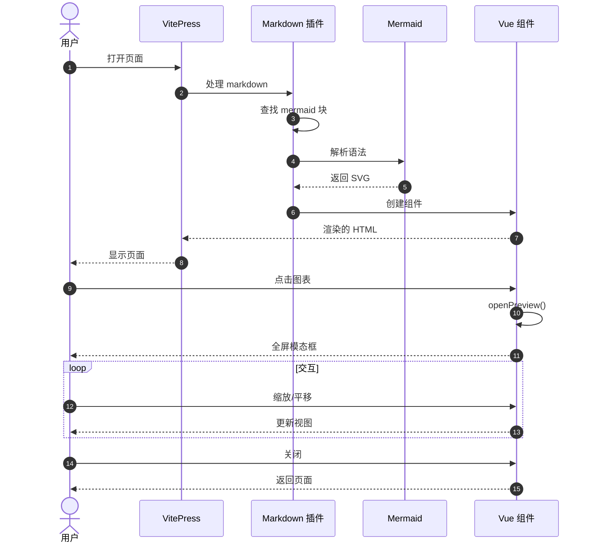

# 时序图示例

时序图展示对象或参与者随时间的交互。

## 基础时序图

```mermaid
sequenceDiagram
    participant A as 用户
    participant B as 浏览器
    participant C as 服务器

    A->>B: 点击图表
    B->>C: 请求全屏
    C-->>B: 返回模态框 HTML
    B-->>A: 显示预览
    A->>B: 缩放/平移
    B-->>A: 更新视图
```

## 带循环和注释

```mermaid
sequenceDiagram
    participant U as 用户
    participant M as MermaidPreview
    participant S as 状态存储

    U->>M: 点击图表
    M->>S: open(svgContent)
    S-->>M: isOpen = true
    M-->>U: 显示全屏模态框

    loop 缩放控制
        U->>M: Ctrl + +/-
        M->>M: 更新缩放
        M-->>U: 重新渲染 SVG
    end

    Note over M,S: 全局状态共享<br/>跨所有组件

    U->>M: 按 ESC
    M->>S: close()
    S-->>M: isOpen = false
    M-->>U: 隐藏模态框
```

## 激活框

```mermaid
sequenceDiagram
    participant C as 客户端
    participant S as 服务器
    participant D as 数据库

    C->>+S: 请求页面
    S->>+D: 查询数据
    D-->>-S: 返回结果
    S->>S: 处理 HTML
    S-->>-C: 发送响应

    Note over C,S: 服务端渲染

    C->>+C: 激活应用
    C->>+S: 加载 Mermaid
    S-->>-C: Mermaid JS
    C->>C: 渲染图表
    deactivate C
```

## 替代路径

```mermaid
sequenceDiagram
    participant U as 用户
    participant P as 预览

    U->>P: 点击图表

    alt 放大
        U->>P: Ctrl + +
        P-->>U: 放大
    else 缩小
        U->>P: Ctrl + -
        P-->>U: 缩小
    else 平移
        U->>P: 拖拽
        P-->>U: 移动视图
    else 关闭
        U->>P: ESC
        P-->>U: 关闭模态框
    end
```

## 复杂示例

```mermaid
sequenceDiagram
    autonumber
    actor 用户
    participant VP as VitePress
    participant MP as Markdown 插件
    participant M as Mermaid
    participant V as Vue 组件

    用户->>VP: 打开页面
    VP->>MP: 处理 markdown
    MP->>MP: 查找 mermaid 块
    MP->>M: 解析语法
    M-->>MP: 返回 SVG
    MP->>V: 创建组件
    V-->>VP: 渲染的 HTML
    VP-->>用户: 显示页面

    用户->>V: 点击图表
    V->>V: openPreview()
    V-->>用户: 全屏模态框

    loop 交互
        用户->>V: 缩放/平移
        V-->>用户: 更新视图
    end

    用户->>V: 关闭
    V-->>用户: 返回页面
```

**点击任意图表以全屏查看！**
