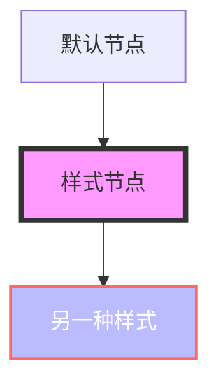

# 配置

了解如何为 VitePress Mermaid 进行自定义配置。

## Markdown 插件选项

`mermaidMarkdownPlugin` 函数接受一个可选的配置对象：

```typescript
import { defineConfig } from 'vitepress'
import { mermaidMarkdownPlugin } from '@unify-js/vitepress-plugin-mermaid/mermaid-markdown'

export default defineConfig({
  markdown: {
    config: (md) => {
      mermaidMarkdownPlugin(md, {
        // 配置选项
      })
    }
  }
})
```

## 组件属性

### Mermaid 组件

`Mermaid` 组件接受以下属性：

| 属性 | 类型 | 默认值 | 描述 |
|------|------|---------|-------------|
| `code` | `string` | - | 要渲染的 Mermaid 图表代码 |

使用示例：

```vue
<script setup>
const diagramCode = `
graph TD
  A[开始] --> B[结束]
`
</script>

<template>
  <Mermaid :code="diagramCode" />
</template>
```

### MermaidPreview 组件

`MermaidPreview` 组件处理全屏预览模态框。使用主题扩展时会自动注册。

## 自定义样式

### CSS 变量

插件使用 CSS 变量，您可以覆盖它们：

```css
/* 预览模态框的自定义样式 */
.mermaid-preview-modal {
  --preview-bg: rgba(0, 0, 0, 0.9);
  --preview-max-width: 90vw;
  --preview-max-height: 90vh;
}

/* 暗黑模式调整 */
.dark .mermaid-preview-modal {
  --preview-bg: rgba(0, 0, 0, 0.95);
}
```

### 设置 Mermaid 图表样式

您可以使用 Mermaid 内置的样式功能：



## TypeScript 支持

### 类型声明

插件包含 TypeScript 声明。如果遇到 `.vue` 文件的问题，请确保您的 `tsconfig.json` 包含：

```json
{
  "compilerOptions": {
    "types": ["vite/client"]
  }
}
```

或者创建一个 `env.d.ts` 文件：

```typescript
/// <reference types="vite/client" />

declare module '*.vue' {
  import type { DefineComponent } from 'vue'
  const component: DefineComponent<{}, {}, any>
  export default component
}
```

## 高级配置

### 自定义主题集成

如果您有自定义的 VitePress 主题，可以集成插件组件：

```typescript
import type { Theme } from 'vitepress'
import CustomTheme from './CustomTheme.vue'
import { enhanceAppWithMermaid } from '@unify-js/vitepress-plugin-mermaid'

export default {
  extends: CustomTheme,
  enhanceApp(ctx) {
    // 您的自定义增强
    enhanceAppWithMermaid(ctx)
  }
} as Theme
```

### 程序化控制

使用 `useMermaidPreview` 组合式函数进行程序化控制：

```vue
<script setup>
import { useMermaidPreview } from '@unify-js/vitepress-plugin-mermaid'

const { isOpen, svg, open, close } = useMermaidPreview()

// 使用自定义 SVG 打开预览
function showDiagram() {
  open('<svg>...</svg>')
}
</script>
```

## 故障排除

### 图表无法渲染

1. 确保在 `.vitepress/config.ts` 中配置了 markdown 插件
2. 检查主题是否正确扩展或组件是否已注册
3. 验证 Mermaid 是否作为对等依赖安装

### TypeScript 错误

如果您看到关于缺少类型的错误：

1. 在 `tsconfig.json` 中添加 `"types": ["vite/client"]`
2. 创建一个包含 Vue 声明的 `env.d.ts` 文件
3. 重启 TypeScript 语言服务器
