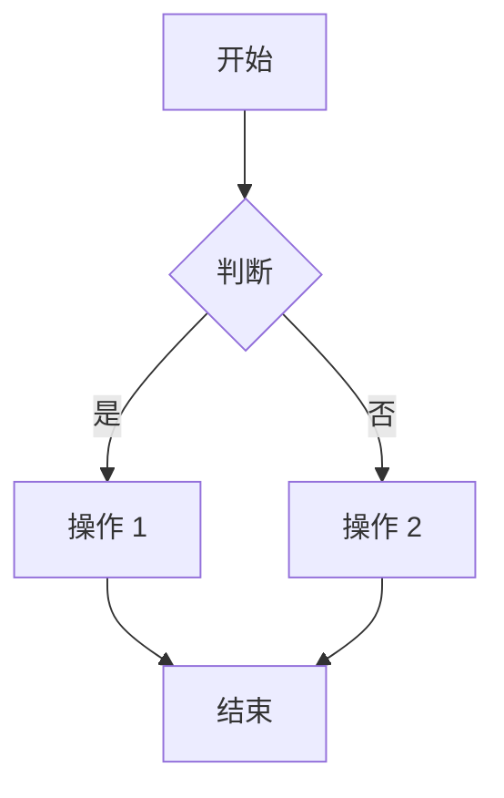
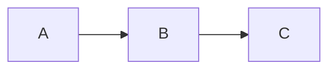

# 快速开始

在几分钟内开始使用 VitePress Mermaid。

## 安装

使用您喜欢的包管理器安装自定义主题：

::: code-group

```bash [pnpm]
pnpm add -D @unify-js/vitepress-mermaid
```

```bash [npm]
npm install -D @unify-js/vitepress-mermaid
```

```bash [yarn]
yarn add -D @unify-js/vitepress-mermaid
```

:::

## 依赖要求

本自定义主题需要以下依赖才能正常工作，请确保已安装：

```bash
pnpm add -D vitepress mermaid
```

## 配置

### 第一步：配置 VitePress 配置

创建或编辑您的 `.vitepress/config.ts` 文件：

```typescript
import { defineConfig } from 'vitepress';
import { withMermaidConfig } from '@unify-js/vitepress-mermaid/config';

export default withMermaidConfig(
  defineConfig({
    // 您的 VitePress 配置
  })
);
```

### 第二步：配置主题

创建或编辑您的 `.vitepress/theme/index.ts` 文件：

```typescript
import type { Theme } from 'vitepress';
import { MermaidTheme } from '@unify-js/vitepress-mermaid';

export default {
  extends: MermaidTheme,
} satisfies Theme;
```

## 使用

配置完成后，您可以在 Markdown 文件中使用 Mermaid 图表：

````markdown

````

这会渲染为：


**点击上方的图表** 打开全屏预览！

## 显示源代码

使用 `mermaid-example` 可以同时显示图表及其源代码：

````markdown

````


## 下一步

- 了解 [开发细节](./development.md)
- 查看更多 [使用示例](./usage.md)
- 查看 [键盘快捷键](./shortcuts.md)
- 浏览 [图表示例](../examples/)
