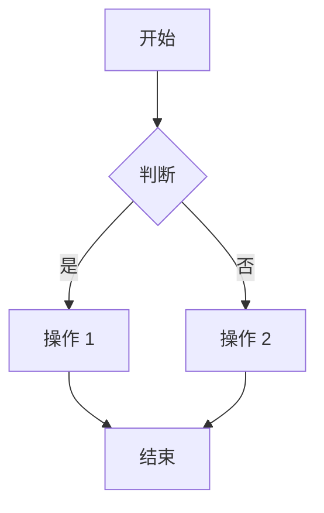
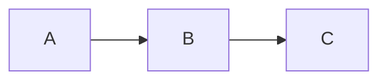

# 快速开始

在几分钟内开始使用 VitePress Mermaid。

## 安装

使用您喜欢的包管理器安装插件：

::: code-group

```bash [pnpm]
pnpm add -D @unify-js/vitepress-plugin-mermaid
```

```bash [npm]
npm install -D @unify-js/vitepress-plugin-mermaid
```

```bash [yarn]
yarn add -D @unify-js/vitepress-plugin-mermaid
```

:::

## 对等依赖

确保您已安装所需的对等依赖：

```bash
pnpm add -D vitepress mermaid vue
```

## 配置

### 第一步：配置 Markdown 插件

创建或编辑您的 `.vitepress/config.ts` 文件：

```typescript
import { defineConfig } from 'vitepress';
import { mermaidMarkdownPlugin } from '@unify-js/vitepress-plugin-mermaid/mermaid-markdown';

export default defineConfig({
  markdown: {
    config: md => {
      mermaidMarkdownPlugin(md);
    },
  },
});
```

### 第二步：配置主题（二选一）

#### 选项 A：主题扩展（推荐）

最简单的集成方式是通过扩展插件的主题：

```typescript
import type { Theme } from 'vitepress';
import mermaidPluginTheme from '@unify-js/vitepress-plugin-mermaid/theme';

export default {
  extends: mermaidPluginTheme
} as Theme;
```

#### 选项 B：手动配置

如需更多控制，请手动注册组件：

```typescript
import { h } from 'vue';
import type { Theme } from 'vitepress';
import DefaultTheme from 'vitepress/theme';
import Mermaid from '@unify-js/vitepress-plugin-mermaid/components/Mermaid.vue';
import MermaidPreview from '@unify-js/vitepress-plugin-mermaid/components/MermaidPreview.vue';

export default {
  extends: DefaultTheme,
  enhanceApp({ app }) {
    app.component('Mermaid', Mermaid);
    app.component('MermaidPreview', MermaidPreview);
  },
  Layout() {
    return h(DefaultTheme.Layout, null, {
      'layout-bottom': () => h(MermaidPreview),
    });
  }
} as Theme;
```

## 使用

配置完成后，您可以在 Markdown 文件中使用 Mermaid 图表：

````markdown

````

这会渲染为：


**点击上方的图表** 打开全屏预览！

## 显示源代码

使用 `mermaid-example` 可以同时显示图表及其源代码：

````markdown

````


## 下一步

- 了解 [配置选项](./configuration.md)
- 查看更多 [使用示例](./usage.md)
- 查看 [键盘快捷键](./shortcuts.md)
- 浏览 [图表示例](../examples/)
