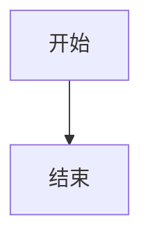
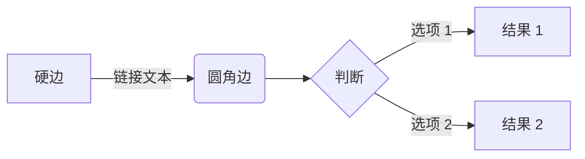
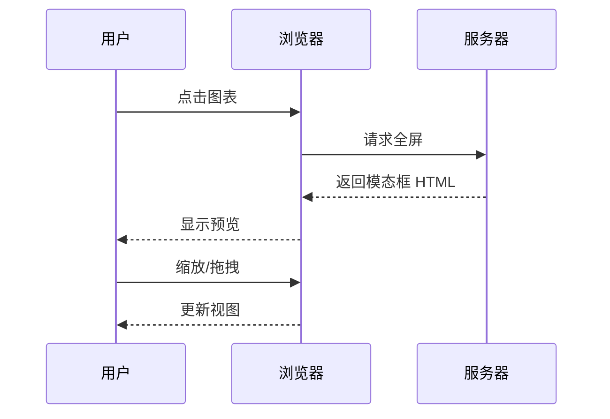
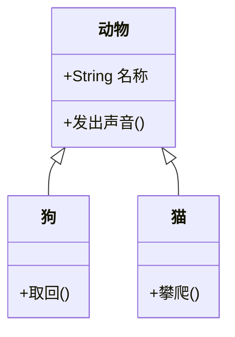
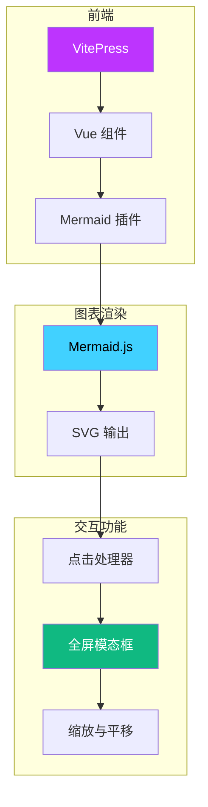
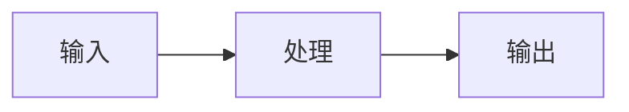
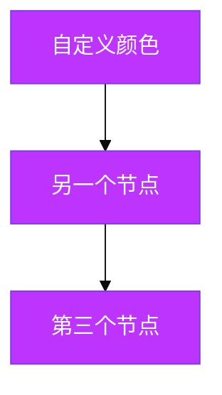
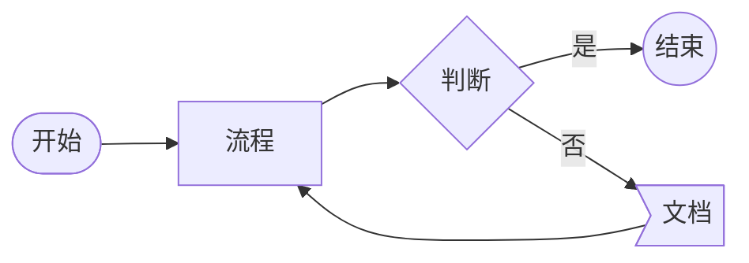

# 使用指南

了解如何在 VitePress 文档中创建和自定义 Mermaid 图表。

## 基本语法

Mermaid 图表使用 `mermaid` 语言标识符的代码块创建：

````markdown

````


## 图表类型

### 流程图

流程图非常适合可视化流程和工作流：

````markdown

````


### 时序图

时序图展示实体间的交互：

````markdown

````


### 类图

类图用于面向对象设计：

````markdown

````


## 交互式预览

### 如何使用

1. **点击** 文档中的任意图表
2. 图表以 **全屏模式** 打开
3. 使用 **鼠标滚轮** 或 **键盘** 缩放
4. **拖拽** 在图表中平移
5. 按 **ESC** 或点击 **X** 关闭

### 示例：复杂图表

尝试与这个较大的图表交互：



**点击上方的图表以全屏模式探索！**

## 显示源代码

使用 `mermaid-example` 同时显示图表及其源代码：

````markdown

````


## 样式技巧

### 颜色和主题

Mermaid 图表会自动适应您的 VitePress 主题：



### 节点形状

不同用途使用不同的节点形状：



## 最佳实践

1. **保持图表聚焦** - 每个图表一个概念
2. **使用有意义的标签** - 清晰简洁的文字
3. **一致的样式** - 有目的地使用颜色
4. **测试交互** - 点击图表确保功能正常
5. **考虑移动端** - 大屏幕可能需要在小屏幕上缩放

## 下一步

- 探索更多 [图表示例](../examples/)
- 了解 [键盘快捷键](./shortcuts.md)
- 查看 [API 参考](../api/)
