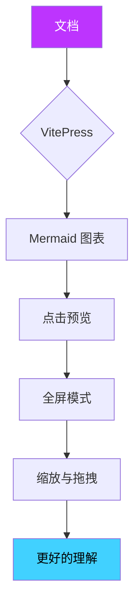

# VitePress Mermaid

强大的 VitePress 自定义主题，为您的文档带来交互式的 Mermaid 图表预览功能。

## 这是什么？

**VitePress Mermaid** 通过添加交互式预览功能来增强您的文档。当读者点击图表时，会以全屏模态框打开，他们可以：

- **缩放** 查看细节
- **拖拽** 在大图表中移动
- 使用 **键盘快捷键** 快速导航
- 享受 **流畅动画** 和 **暗黑模式** 支持

## 快速预览

点击下方的图表来体验预览功能：

## 为什么要使用这个自定义主题？

| 特性           | 好处                     |
| -------------- | ------------------------ |
| **全屏预览**   | 无需滚动即可查看复杂图表 |
| **缩放控制**   | 检查大图中的细节         |
| **拖拽/平移**  | 轻松浏览大型图表         |
| **键盘快捷键** | 快速高效的控制           |
| **暗黑模式**   | 无缝主题切换             |
| **移动端支持** | 移动设备上的触摸手势     |

## 下一步

- **[快速开始](./guide/getting-started.md)** - 安装和配置自定义主题
- **[配置](./guide/configuration.md)** - 根据需要自定义主题
- **[示例](./examples/)** - 查看各种类型的图表效果
